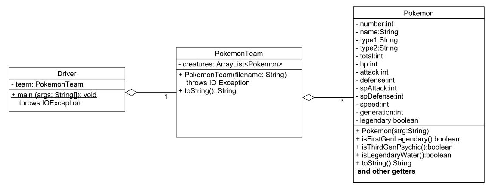

实验三，读取文件数据
======

# 介绍
从文件中读取数据，然后在程序中分析，是编程经常要干的事情。一旦文件中的数据被加载到内存数据结构，就可以进一步分析，并呈现给用户，当然也可以再暴露给其它方使用。因此，作为一个专业程序员，从文件中读取数据是一个非常有用的技能。

在本实验中，我们将文件中的数据加载到一个内存数据结构，分析数据，然后将结构化的信息呈现给用户。我们提供了三个类的规范，以及一些用于检查输出的简单测试。你的任务就是根据我们提供的规范完成类的实现。

# 学习目标
完成本实验后，你应该能够：
- 阅读和理解方法级的规范（包括UML图），
- 从文件中读取数据，
- 完成包含多个实例变量和方法的实现类，
- 使用文件中的信息创建一个对象数组，
- 扫描对象数组并显示符合某个条件的项。

# 实验步骤

###步骤1
下载[lab3.zip](labs/lab03/lab3.zip)

### 步骤2
*File*菜单：*Import*

### 步骤3
选择*General/Existing Projects into Workspace，然后点击*Next*

### 步骤4
选择*archive file*：导航到lab3.zip文件

### 步骤5
点击*Finish*

### 步骤6
一旦你创建了新项目，它并不知道如何找到标准Java库（根据你配置的不同而不同）。在提供的一个Java文件中，找一个未定义的标准类（例如，*String*)，将鼠标置于其上，Java会列出修复的方法：
- 选择*Fix project setup*
- 选择*Add library: JRE System Library*
- 点击*OK*

# 实验三
在本试验中，你将解析由[Kaggle网站](https://www.kaggle.com/abcsds/pokemon)编辑和提供的包含Pokemon(游戏小精灵)列表的文件，该文件包含每个Pokemon的各种统计。文件以CSV(comma separated values)的形式将信息编码在一个表格中。如果你在Eclipse中双击这个文件，它会试图用如Excel这样的电子表格程序打开。你也可以用如文本编辑器以原始文件形式打开。

文件中的每一行编码一个Pokemon的信息，每个Pokemon有13个不同的值描述，每个值用逗号分隔，包括：
1. Pokemon的编号(number)，注意Pokemon的编号不是值唯一的，例如，三代不同的Charizard(喷火龙）都用编号6，这不会影响项目的结果
2. Pokemon的名称(name)，同样，这也不是唯一的
3. Pokemon的第一类型(type)
4. Pokemon的第二类型(type)，可以为空
5. 如下统计的总和
6. Pokemon的生命点数(HP)
7. 常规攻击基准调整值
8. 针对常规攻击的基准伤害抵抗
9. 特殊攻击基准调整值
10. 针对特殊攻击的基准伤害抵抗
11. Pokemon的速度
12. Pokemon的代数(generation)
13. 是否传奇Pokemon

本实验中你的任务是从指定文件中将Pokemon的数据读入，存入Pokemon对象列表，然后扫描查找符合某个条件的Pokemon。

# 类
下面的UML图总结了本次实验要实现的类



**Pokemon**类表示单个Pokemon，下面是要实现的方法：
- `Pokemon`构造函数，传入和一个pokemon对应的字符串，解析该字符串并填充类变量
- `isFirstGenLegendary()`，该方法表明一个*Pokemon*对象是否是第一代并且是传奇的
- `isThirdGenPsychic()`，该方法表明一个*Pokemon*对象是否是第三代并且是通灵类型的
- `isLegendaryWater`，该方法表明一个*Pokemon*对象是否是第三代水类型的
- `toString()`，该方法返回一个字符串，格式见[lab3-expectedOutput](lab3-expectedOutput.md)
- 一组访问器getters方法，可以用Eclipse自动生成

**PokemonTeam**类表示一个*Pokemon*团队，下面是要实现的方法：
- `PokemonTeam`构造函数，传入一个文件名，读取文件，为文件中的每一行创建一个*Pokemon*对象，并添加到一个ArrayList中
- `toString()`，该方法返回一个字符串，格式见[lab3-expectedOutput](lab3-expectedOutput.md)

**Driver**类包含一个PokemonTeam对象和main()方法，在main()方法中：
- 用指定的文件名创建一个*PokemonTeam*对象
- 打印出*PokemonTeam*对象

# 读取文件
PokemonTeam构造函数必须读取和解析一个文件，下面的样例代码读取每一行并将其加入列表：
```java
ArrayList<String> list = new ArrayList<String>()； // ArrayList of Strings
    BufferedReader br = new BufferedReader(new FileReader("filename.txt"));
    
    String strg = br.readLine(); // Read first line
    while (strg != null) //Iterate as long as there is a next line
    {
        list.add(strg); // Add the line to the ArrayList
        strg = br.readLine(); // Attempt to get the next
    }

```
(当然，你需要创建Pokemon对象实例并添加到你的ArrayList中)。

一个*BufferedReader*可以接受不同的输入流作为参数，在实验一我们用了一个*InputStreamReader*来读取来自*System.in*（键盘）的输入。本实验用了一个*FileReader*。一个*FileReader*以一个文件名作为参数，注意文件名是一个字符串（有双引号）。样例的第2行打开文件，转成可以被*BufferedReader*使用的*FileReader*对象。

# 在Eclipse中自动生成Getters和Setters方法

Eclipse能够为你自动生成访问器(getters & setters)方法，方法如下：

- 声明所有的实例变量
- 从工具条上选择*Source*
- 从下拉菜单中选择*Generate Getters and Setters...*

从菜单中，你可以选择需要生成的每个类变量，你可以选择生成所有的getters，或者setters，或者都生成。对于本次实验，记住你要创建的是不可变（immutable）类。

#最后步骤

### 步骤1
使用Eclipse生成Javadoc
- 选择*Project/Generate Javadoc...*
- 确保你的项目被选中（包含Driver, Pokemon和PokemonTeam类）
- 选择*Private*可见性
- 使用缺省的目标目录
- 点击*Finish*


### 步骤2
在Eclipse或者你常用的浏览器中打开lab3/doc/index.html文件。 确保Javadoc中包含你的类，所有的方法包含必要的Javadoc文档。


# 参考
- [BufferedReader API](http://docs.oracle.com/javase/8/docs/api/java/io/BufferedReader.html)


 


