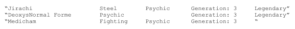
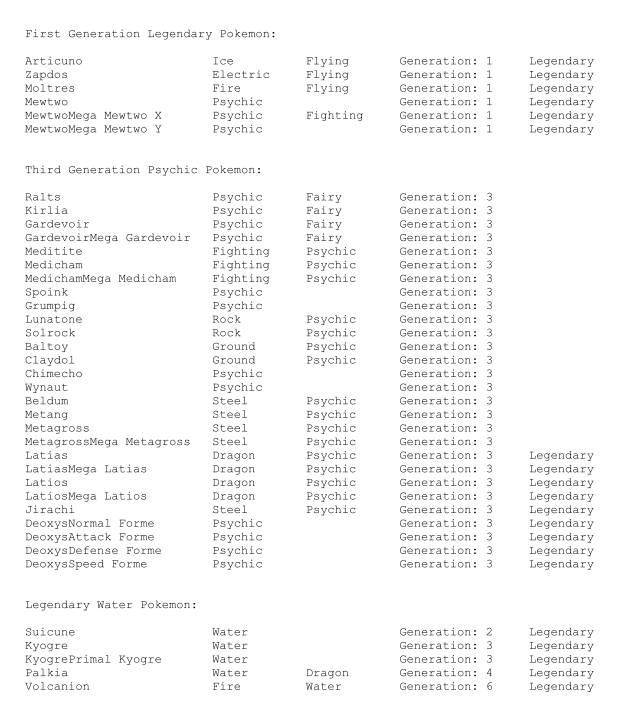

### Pokemon toString()方法
Pokemon类中的toString()方法返回一个如下格式的字符串：
- 名称name，左对齐，长度25
- 一个空格
- 类型1，左对齐，长度12
- 一个空格
- 类型2，左对齐，长度12（即使pokemon只有一个类型）
- 一个空格
- "Generation:"
- 代，左对齐，长度6
- "Legendary"如果pokemon是传奇的

**注意**，双引号只是用于表明字符串起止。

# PokemonTeam toString()方法

PokemonTeam类中的toString()方法返回一个如下格式的字符串：
- "First Generation Legendary Pokemon:"
- 一个空行
- 所有第一代和传奇的pokemon
- 两个空行
- "Third Generation Psychic Pokemon:"
- 一个空行
- 所有第三代通灵类型的pokemon
- 两个空行
- "Legendary Water Pokemon:"
- 一个空行
- 所有传奇的和水类型的pokemon

来自Pokemon.csv文件的期望输出如下：

