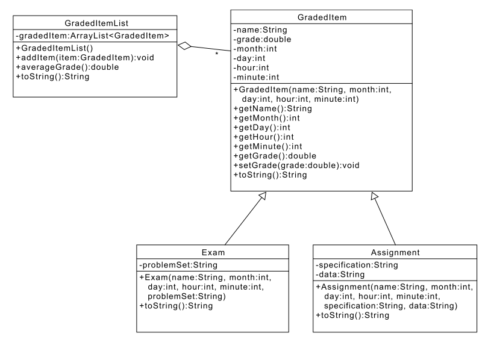

实验四：继承
======

# 介绍
本实验中，我们考察对象之间的关系。考虑我们为了计算本课程成绩而记录的每一项，每一个*GradedItems*有一个名称(name)，一个日期(date)和一个分数。但是，根据GradedItem的类型，也需要记录其它信息，例如一个项目的描述，或者用于测试你的项目的文件名。在本实验中，我们将使用类继承来表达不同item类型可以有一些相同的属性，也可以有其它不同的属性。

本实验中，我们将创建打分项目类，包括考试项目和作业项目，和打分项目列表。请思考这些对象是如何关联的，我们要提供一个完整的UML图来表达这些关系。你的任务是实现这些类并做完整的单元测试。

# 学习目标
完成本实验后，你应该能够：
- 阅读和理解UML图
- 根据规范实现类
- 创建类关系
- 理解*is-a*和*has-a*之间的关系
- 为你的类开发测试过程

# 准备

将已有的lab4实现导入你的eclipse工作区
1. 下载[lab4实现](lab4.zip)
2. 在Eclipse中，选择*File/Import*
3. 选择*General/Existing projects into workspace.* 点击*Next*
4. 选择*Select archive file*，导航到lab4.zip文件，点击*Next*
5. 在*Package Explorer*中，选择*lab4*
6. 右击，选择*Build Path/Configure Build Path*
7. 选择*Java Build Path*
8. 点选*Libraries*面板
9. 点选*Add Library*
10. 选择*JRE System Library*，点击*Next*
11. 选择*Workspace default JRE*，点击*Finish*
12. 点击*Add Library*
13. 选择*Junit*，点击*Next*
14. 选择*JUnit4*，点击*Finish*
15. 点击*Apply*（如果Eclipse显示这个按钮的话），然后*OK*
16. 如果在*Package Explorer*中有一个或者多个源文件被标记为有错误（声明的包""和期望的包"src"不匹配）：给类文件添加一个空格，保存，关闭窗口再重新打开

# 打分项目类表示

下图是打分项目相关类的UML表示，你的任务是实现这些类和相应的单元测试：



从Exam到GradedItem表示Exam is-a GradedItem，你应该用继承来表达这种关系，Assignment和GradedItem之间的类关系也一样。

从GradedItemList到GradedItem之间的线表示GradedItemList has-a GradedItem，可以看到GradedItemList方框中间有一个GradedItem属性（实例变量）。除此属性，对于has-a关系没有其它需要添加的。关系上的"*"表明GradedItemList可以和任意多的GradedItem对象关联（1对多关系）。实现中，这种关系通过GradedItemList中的ArrayList<GradedItem>表达。

# 实验步骤

### 步骤1
为UML图中的每个类创建一个新的Java类
- 确保类名和UML中一致
- 你必须用缺省包，也就是说当你创建类时package字段必须留空

### 步骤2
为每个类实现UML标明的属性和方法
- 使用UML中标明的拼写和可见性
- 除了UML标明之外，不要添加额外功能
- 不要忘记javadoc文档！

### 步骤3
GradedItem.toString()：对于名为"Final"，月份12，日期13，小时8，分钟0和分数0.78的打分项，toString()必须返回如下格式的字符串：

```
"Final (date: 12-13 at 08:00): grade = 0.78"
```

### 步骤4
Exam.toString()：对于和上面一样的终考，试卷文件"fianl.pdf"，toString()必须返回如下格式的字符串：

```
"Final (date: 12-13 at 08:00): grade = 0.78: problem set = final.pdf"
```

### 步骤5
Assignment.toString(): 对于一个称为"Lab 1"，规范文件"lab1.pdf"和数据文件"calendar.csv"的作业，toString()必须返回如下格式字符串：

```
"Lab 1 (date: 08-26 at 23:59): grade = 0.50: specification = lab1.pdf; data source = calendar.csv"
```

注意toString()方法必须使用GradedItem提供的toString()方法。

### 步骤6
GradedItemList.toString()必须返回一个将列表中所有单个项连接起来的字符串，每个项后面跟一个新行字符("\n")。项的顺序和他们被添加到GradedItemList中的顺序一致。

### 步骤7
创建一个或者多个JUnit类以全面测试你的代码
- 你必须确保所有主要的类被覆盖，且功能正确
- 我们提供少量样例测试类，但是，仅这些测试是不够的

# 最后步骤

### 步骤1
使用Eclipse生成Javadoc
- 选择*Project/Generate Javadoc...*
- 确保你的项目被选中（包含GradedItem, Exam，Assignment和GradedItemList类）
- 选择*Private*可见性
- 使用缺省的目标目录
- 点击*Finish*


### 步骤2
在Eclipse或者你常用的浏览器中打开lab4/doc/index.html文件。 确保Javadoc中包含你的类，所有的方法包含必要的Javadoc文档。


