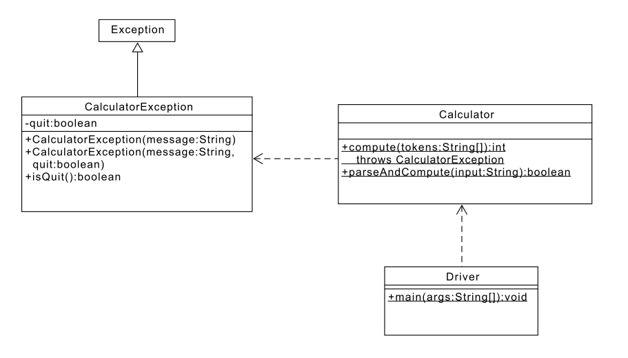

实验五：异常
======

# 介绍
本实验关注异常（Exception）的使用，异常用于捕捉各种可能出现的错误，让你的程序采取恰当的纠正性动作。在本实验中，你将实现一个简单的计算器程序，该程序允许用户指定一个操作符和最多两个操作数（参数）。你的程序将解析这些输入，执行操作并打印结果。过程中如果有错误出现，你的程序将捕获错误，并且给用户提供恰当的反馈信息。

# 学习目标
完成本实验后，你应该能够：
- 创建一个程序，通过命令行方式和用户交互
- 实现和抛出一个定制的异常
- 使用try/catch块健壮地处理异常

# 准备
下载[lab5](lab5.zip)实验的部分实现

# 用户交互

用户输入的每一行都被解释为一个潜在的表达式，有效的表达式由一个，两个或者三个符号(token)组成，每个符号和前面的符号之间用一个空格分隔，可能的形式如下：
- 1个符号：[**quit**]，程序退出
- 2个符号：[**UOP N**]，其中N是一个整数，并且UOP是一个单元操作符(-)，程序显示给定整数的负数表示
- 3个符号：[**N1 BOP N2**]，其中N1和N2是整数，BOP是一个二元操作符(+，-，*，/，或者%)，程序显示对两个操作数按照指定操作符进行计算后的结果。

如果输入非法，或者格式不正确，则显示特定的错误消息。

下面是和用户的一个交互样例，用户输入和程序响应都输出了：

```
4 + 2
The result is: 6
42+7
Illegal input.
4 - 2
The result is 2
4 / 2
The result is 2
4 % 2
The result is 0
foo + 2
Illegal argument.
42 * 3
The result is: 126
42 * bar
Illegal argument.
42 ^ 3
Illegal argument.
32 ^ baz
Illegal argument.
foobar ^ 3
Illegal argument.
4 / 0
Divide by zero error.
42 % 0
Mod by zero error.
-4
Illegal input.
- 4
The result is: -4.
QUIT
Exit.
```

# 类设计
下面是你要在实验中实现的类的UML表示，请按图命名你的实例变量和方法名。在该图中，你看到引入了新的UML标记：带箭头的虚线表示类之间有某种松散的关系。它不是*is-a*关系（类继承），也不是*has-a*关系（一个类或者变量引用另外一个类），而是表明一个类的局部变量引用了另外一个类。

*Exception*类是由Java API提供的，*CalculatorException*继承自*Exception*，增加了一个称为*quit*的实例变量。该标记表明程序应当终止。该类提供两个不同的构造函数：一个允许调用方设置*quit*标记；另外一个将*quit*标记设置缺省值*false*。



*Calculator*类提供了两个方法，下面的方法以一个字符串作为参数，该字符串被解释为一个表达式：

```java
    public static boolean parseAndCompute(String input)
```
该方法：

1. 将字符串分割为一组符号（通过空格分割）
2. 调用*compute()*评估表达式
3. 打印出结果或者一个错误消息
4. 返回一个表明程序是否应该终止的布尔值

*compute()*方法负责解释符号集并生成结果：

```java
    public static int compute(String[] tokens) throws CalculatorException
```
如果是由两个或者三个符号组成的有效表达式，那么该方法就返回整型结果。对于所有其它情况，该方法抛出一个*CalculatorException*，它将错误字符串编码在*Exception*的*message*属性中。如果仅有一个符号输入，且这个符号和字符串"quit"相等（不论大小写），异常对象的*quit*标记就会被设置为*true*。关于异常消息的细节请参考我们给出的骨架代码。

你必须实现你自己的*CalculatorTest*单元测试类，我们给出了CalculatorSampleTest类，提示你如何测试异常。

提供的*Driver*类负责打开用户输入流，重复读取和评估输入行，直到接收到*quit*指令。

# 实现步骤
1. 完成*CalculatorException*类的实现
2. 完成*Calculator*类的实现
3. 实现对*Calculator*类的单元测试


# 最后步骤

使用Eclipse生成Javadoc
- 选择*Project/Generate Javadoc...*
- 确保你的项目被选中，包括所有的Java文件
- 选择*Private*可见性
- 使用缺省的目标目录
- 点击*Finish*


### 步骤2
在Eclipse或者你常用的浏览器中打开lab5/doc/index.html文件。 确保Javadoc中包含你的类，所有的方法包含必要的Javadoc文档。

# 提示
- *Exception*的*message*属性应该被用于编码错误消息，
- 用一个*catch*语句捕获所有的*Exceptions*不是一个好的编程实践（除非你确实是要捕获所有的异常）。相反，你应该仅捕获你预期发生的特定异常，这样，其它未预期的异常仍然会造成程序终止，方便你进一步排查问题。

