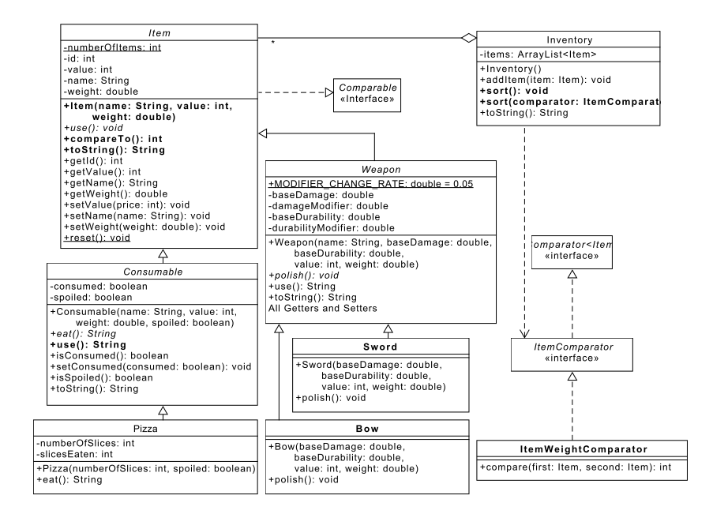

实验六：抽象类和接口
======

# 介绍
在本实验中，你将通过使用抽象类和接口来体验Java继承。延续实验2的游戏主题，你将实现一组用于表示不同类型库存项(inventory of items)的类。另外，你将实现Item对象的比较，即便它们是不同类型的Item。

# 学习目标
完成本实验后，你应该能够：
1. 创建并扩展抽象类和方法
2. 用接口在多个类间定义标准行为

# 准备
在你的eclipse工作区中导入已有的[lab6](lab6.zip)实现

# 库存项类设计
下面的UML表示库存和各种类型库存项的对应的类，你的任务是实现这些类，并实现相应的单元测试代码。需要你实现的类和方法在UML中以粗体字表示。



以斜体表示的类是抽象类或者接口。具体的子类必须实现抽象父类的所有方法。在本实验中，**Item**，**Consumable**和**Weapon**是抽象类。

从**Item**到**Comparable**的线表示**Item**必须实现**Comparable**接口。类似的，**ItemWeightComparator**类必须实现**ItemComparator**接口（该接口继承**Comparator**接口）。**ItemWeightComparator**根据高度比较不同的库存项。

# 实验步骤
**Item**类是游戏中存在的所有类型库存项的公共祖先：

- 所有的**Item**实例都有一个唯一的整型*id*，由**Item**构造函数赋值，第一个item实例赋予*id*=0，下一个赋予1，依次类推。注意你可以利用提供的类变量来方便你实现构造函数（还有一个静态的*reset()*，方便你写单元测试）。
- *compareTo(Item other)*：**Item**类实现**Comparable**接口，你需要为类添加*compareTo(Item other)方法。*compareTo(Item other)方法接受另外一个**Item**实例作为参数，并和当前实例进行比较。如果当前实例的*value*字段大于*other的value*字段，那么方法就应该返回一个正整数（惯例是1）。如果当前实例的*value*字段小于*other的value*字段，那么方法就应该返回一个负整数（惯例是-1）。如果两者相等，就以items的name的字符串序进行比较（相当于比较字符串的每个字符，忽略大小写，例如A == a），返回恰当的值。*提示：你可以利用String类API本身提供的功能*。
- *Item.toString()：对于一个*name*为"ring"，*value*为3000，*weight*为0.013的**Item**，该方法应该返回一个如下的字符串：
```
ring -- Value: 3000, Weight: 0.01 
```

**ItemWeightComparator**类实现**ItemComparator**接口，意思是该类的实例可以被传递给需要类型为**Item**的comparator的方法。

- **ItemWeightComparator**的*compare(Item first, Item second)方法的功能和**Item**类的*compareTo(Item other)方法类似，但是比较的是**Items**的*weight*字段，如果weights是相等的，该方法应该调用*第一个* **Item**的*compareTo(Item other)*方法并返回结果值。

**Weapon**类是**Item**的一个抽象实现，它表示使用后可以造成伤害和损坏的项目。该类的实现已经提供给你。所有的**Weapon**实例有一个基准伤害值*baseDamage*和一个修正值*damageModifier*。这两个值的和决定了该武器使用后所能造成的*有效伤害*。另外，**Weapons**有一个基准牢固度值*baseDurability*，和一个对应的修正值*durabilityModifier*。这两个值的和决定了**Weapon**的有效牢固度。当该值降到零或更少，有效牢固度就是零，该武器被认为是坏了且无法再使用。

我们提供了几个已实现的方法，包括：

- *Weapon.getDamage()*：返回**Weapon**的有效伤害
- *Weapon.getDurability()*：返回**Weapon**的有效牢固度
- *Weapon.toString()*：对于*name*是"hammer"，*value*是300，*weight*是2.032，*baseDamage*值是30.4219，*damageModifier*值是0.05，*baseDurability*值是0.7893，*durabilityModifier*为0.05的一个**Weapon**，方法将返回如下格式的字符串：
```
hammer -- Value: 300, Weight: 2.03, Damage: 30.47, Durability: 83.93%
```
- *Weapon.use()*：该方法返回一个字符串，描述当一个**Weapon**被使用时，会发生什么。对于一个名为"hammer"的**Weapon**，有效伤害30.4725，方法返回如下：
```
You use the hammer, dealing 30.47 points of damage.
```
"使用"一个**Weapon**将减少其有效牢固度，减去数值*Weapon.MODIFIER_CHANGE_RATE*，如果**Weapon**的有效牢固度到达或者低于0，那么这个**Weapon**就会损坏。如果**Weapon**损坏，该方法应该返回之前的字符串，外加一个新行和额外文本"The hammer breaks."：
```
You use the hammer, dealing 34.05 points of damage.
The hammer breaks.
```
对于一个*name*为"hammer"的**Weapon**，如果它已经"损坏"（有效牢固度<=0），调用其*use()*方法将返回如下：
```
You can't use the hammer, it is broken.
```
在这种情况下，不需要改*durabilityModifier*。

**Sword**类是**Weapon**的一个具体实现，你必须提供：
- Sword类的所有实例的*name*是"sword"
- *Sword.polish()*：每次该方法被调用时，该方法将实例的**damageModifier**增加*Weapon.MODIFIER_CHANGE_RATE*，直到*baseDamage*值的25%。如果一个sword的基准伤害到100，那么最大有效伤害能够增加到125。

**Bow**类是**Weapon**类的具体实现，你必须提供：
- Bow类的所有实例的*name*是"bow"
- *Bow.polish()*：该方法将实例的**durabilityModifier**增加*Weapon.MODIFIER_CHANGE_RATE*，更改将被限制以使**有效牢固度"不会大于1。

和实验2非常类似，**Inventory**在游戏中是items的容器。该类已经被部分实现，但你需要添加如下方法：
- *Inventory.sort()*：根据*值value*对**Inventory**实例中的items进行排序
- *Inventory.sort(ItemComparator comparator)*：根据*高度weight*对**Inventory**实例中的items进行排序。

**Consumable**类表示可以被玩家吃的items。Consumables可以被标记为已经消费了，可以是变质的。这些属性分别被存储在*consumed*和*spoiled*实例变量中。新创建的**Consumable**对象应该将其*consumed*字段设置为false。

- *Consumable.use()*：如果一个**Consumable**没有变质也没有被消费，调用这个方法仅返回对*Consumable.eat()*调用的返回值。对于一个name为"break"并且已经被消费的**Consumable**，该方法返回如下：
```
There is nothing left of the bread to consume.
```

假定这个**Consumable**名为"bread"，调用它的**eat()**方法的返回值如下：
```
You eat the bread.
```

如果这个"bread"是变质的，该方法返回字符串，附加一个新行和文本"You feel sick."
```
You eat the bread.
You feel sick.
```

# 具体说明
从lab6.zip提供的类文件开始
1. 修改**Item**，**Consumable**和**Inventory**类
2. 创建**Sword**，**Bow**和**ItemWeightComparator**类
    - 确保类名遵循规范
    - 你必须使用缺省包，也就是说类的包部分必须为空
3. 如有必要，使用**Driver**类做快速测试。
4. 为你创建和修改的类创建JUnit单元测试，必须确保所有功能正确


# 最后步骤

### 步骤1
使用Eclipse生成Javadoc
- 选择*Project/Generate Javadoc...*
- 确保你的项目被选中，包括所有的Java文件
- 选择*Private*可见性
- 使用缺省的目标目录
- 点击*Finish*


### 步骤2
在Eclipse或者你常用的浏览器中打开lab6/doc/index.html文件。 确保Javadoc中包含你的类，所有的方法包含必要的Javadoc文档。

