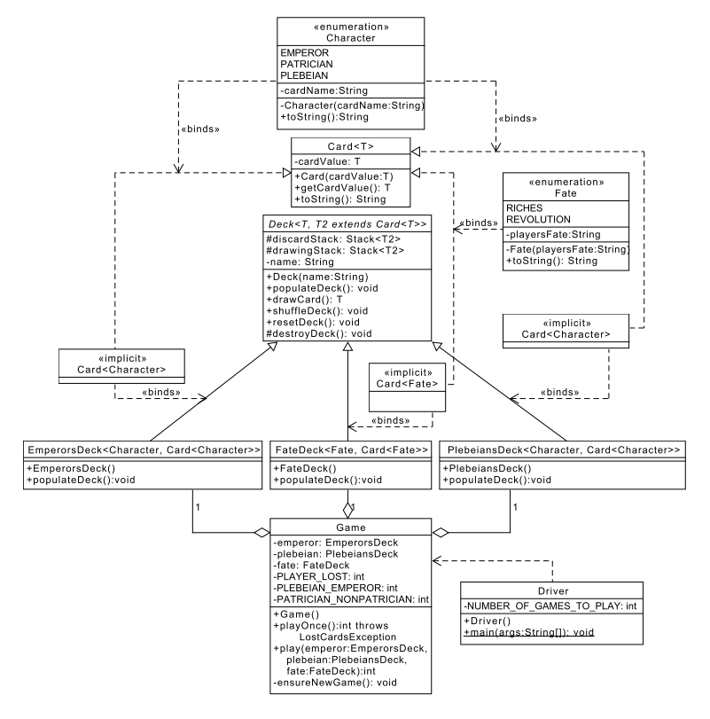

实验七：泛型、列表和栈 
======

# 介绍
在本实验中，你将体验泛型（Generics）的使用。泛型让你能对类型进行抽象。更具体说，在定义类、接口和方法时，泛型让你可以参数化类型（类或者接口）。我们将创建一个纸牌游戏，该游戏使用泛型来创建三副牌，牌有两种类型，一种类型基于牌上的人物，另外一种类型基于牌上的运数。虽然我们有两种不同类型的牌，两类都需要一套标准的操作（包括洗牌和换牌）。通过用Java泛型实现一个泛的Desk类，我们仅需实现这些方法一次，该实现可以用于各种不同类型的牌。

作为Desk实现的一部分，我们也将使用Java集合框架中的Stack类来存放用过和没有用过的牌。

# 学习目标
完成本实验后，你应该能够：
1. 使用Java中的泛型创建类
2. 使用泛型解决更大型问题
3. 使用Stack类存放和获取对象

# 准备
将现有的lab7实现导入到你的eclipse工作区，
- 下载[lab7](lab7.zip)实现
- 在Eclipse中，选择*File/Import*
- 选择*General/Existing projects into workspace*，点击*Next*
- 选择*Select archive file*，导航到lab7.zip文件，点击*Finish*


# 命运卡牌游戏
该游戏有三副牌：一副帝王牌（Emperor's Deck），一副平民牌（Plebeian's Deck），和一副命运牌（Fate Deck），玩游戏规则如下：
- 玩家先从命运牌中抽取一张牌
    - 如果玩家抽到的是财富（Riches）牌，他们将收到一副帝王牌，对手则收到平民牌。
    - 如果玩家抽到的是革命（Revolution）牌，他们将收到一副平民牌，对手则收到帝王牌。
- 然后每个玩家从他们的牌中抽取顶部的牌，摊牌和对手比
    - 如果两张牌都是贵族（Patrician），结果是平局。两个玩家从他们各自的牌中抽取下一张牌，重复直到两个玩家抽到的牌不同
    - 如果是帝王碰到平民，平民胜，相应的玩家赢得4个点
    - 如果是帝王碰到贵族，帝王胜，相应的玩家赢得1个点
    - 如果是平民碰到贵族，贵族胜，相应的玩家赢得1个点
- 如果要玩多次游戏，则将每副牌洗牌，然后玩家通过抽取命运牌重新开始。

程序的完整实现将首先创建一副帝王牌，一副平民牌，和一副命运牌，然后将三副牌都洗牌。程序然后会玩50次游戏，将每局的结果报告到控制台上（如果需要，你可以随意将Driver类中的次数改得更大）。

# 类设计
下面是本实验实现相关类的UML表示，

注意我们引入了一些新的UML标记：
- 我们将泛型类表示为两类，一类是泛型类型未定义的，一类是将泛型类型绑定到某种其它类型（例如，Card&lt;T&gt; vs Card&lt;Character&gt;）。
- 尽管我们会显式的实现泛型类（Card&lt;T&gt;），我们并不提供一个显式绑定类实现（Card<Character>）- 编译器会为我们做的！因此，绑定类标记为"<<implicit>>"。
- "<<binds>>"标记线显式地告诉我们泛型类型对应的绑定目标。

我们项目中的关键类型是：
- **Character**是一个枚举类型，定义一组任务类型。也就是帝王，贵族和平民。
- **Fate**是一个枚举类型，定义最初牌的分配，也就是革命牌和财富牌。
- **Card**泛型类型由泛类型**T**定义。从Card&lt;Character&gt;和Card&lt;Fate&gt;到**Card**的两个箭头表示**Card**的泛型类型绑定到两个不同类型：一个和**Character**绑定，另一个和**Fate**绑定。
- **Deck**是一个抽象类，由一对泛型类型定义：**T**和**T2**。**T**定义**Card**的底层泛型类型（在本案中，是**Character**或者**Fate**），T2是**Card**的一种形式（明确讲，**T2** is-a Card&lt;T&gt;）。
- 从**EmperorsDeck**，**PlebeiansDeck**，和**FateDeck**到**Deck**的线表示**EmperorsDeck**，**PlebeiansDeck**，和**FateDeck**继承自**Deck**。注意，这些子类也显示地将**T**和**T2**绑定到特定的Card类型。例如，**FateDeck**显式地将**Fate**绑定到**T**，Card&lt;T&gt;绑定到Card&lt;Fate&gt;。

# 实验7：实现步骤
从我们在lab7.zip中提供的类文件开始。
1. 类**Card**，**Character**，**PlebiansDeck**，和**Driver**已经被完整实现了，**不应该再被修改**。
2. **Deck**类是一个泛型和抽象类，该类已经为你部分实现，你需要完整实现在UML中列出的每个方法。
3. 创建和实现一个枚举类**Fate**，每个枚举由相关联的字符串类描述。*RICHES*表示玩家的命运是"你是帝王"，*REVOLUTION*表示玩家的命运是"你是平民"。每个Fate枚举的字符串表示应当只返回玩家的命运。
4. 创建和实现类**FateDeck**，这副牌的名称应当存为"The Deck of Fate"。*populateDeck()*方法应当首先销毁之前创建的牌，然后将牌填充一张*RICHES*类型的牌和一张*REVOLUTION*类型的牌。
5. 创建和实现类**EmperorsDeck**，这副牌的名称应当存为"Emperor's Deck"。*populateDeck()*方法应当首先销毁之前创建的牌，然后填充一副完整的牌。特别地，该方法应该放置4张*PATRICIAN*类型的牌和1张*EMPEROR*类型的牌。
6. **Game**类已经为你部分实现，你需要实现*play()*方法。*play()*在给定一副帝王牌、一副平民牌和一副命运牌的情况下，玩一把游戏（规则如上面的命运牌游戏所述），然后报告输出玩家接收到的点数。*这些点数必须使用Game类中创建的常量，包括constPlayerLost修正值*：
    - 如果出现平民/帝王组合牌，失败方玩家得constPlebeianEmperor常量乘以constPlayerLost修正值，
    - 如果出现贵族/非贵族组合牌，失败方玩家得constPatricianNonPatrician常量乘以constPlayerLost修正值。
7. 创建JUnit单元测试，完整地测试你创建和实现的所有类和方法
    - 确保所有功能正确
    - 确保方法中的所有情况被覆盖。

# 输出样例
下面是一个完整程序的输出，玩6把，结束后报告玩家的总分数，你实现的游戏的输出细节可能有所不同：

```
////////// FATE GAME START //////////
Player's Current Total Score: 0
///// You are the Plebeian /////
You: Patrician
Opp: Patrician
You: Patrician
Opp: Patrician
You: Patrician
Opp: Patrician
You: Patrician
Opp: Patrician
You: Plebeian
Opp: Emperor
Player's Current Total Score: 4
///// Your are the Plebeian /////
You: Plebeian
Opp: Emperor
Player's Current Total Score: 8
///// Your are the Emperor /////
You: Emperor
Opp: Patrician
Player's Current Total Score: 9
///// You are the Plebeian /////
You: Patrician
Opp: Patrician
You: Patrician
Opp: Patrician
You: Patrician
Opp: Emperor
Player's Current Total Score: 8
///// Your are the Emperor /////
You: Patrician
Opp: Patrician
You: Emperor
Opp: Patrician
Player's Current Total Score: 9
///// You are the Plebeian /////
You: Patrician
Opp: Patrician
You: Patrician
Opp: Patrician
You: Patrician
Opp: Patrician
You: Patrician
Opp: Emperor
////////// FATE GAME END //////////
Player's Final Score: 8
```


# 最后步骤

### 步骤1
使用Eclipse生成Javadoc
- 选择*Project/Generate Javadoc...*
- 确保你的项目被选中，包括所有的Java文件
- 选择*Private*可见性
- 使用缺省的目标目录
- 点击*Finish*


### 步骤2
在Eclipse或者你常用的浏览器中打开lab7/doc/index.html文件。 确保Javadoc中包含你的类，所有的方法包含必要的Javadoc文档。

