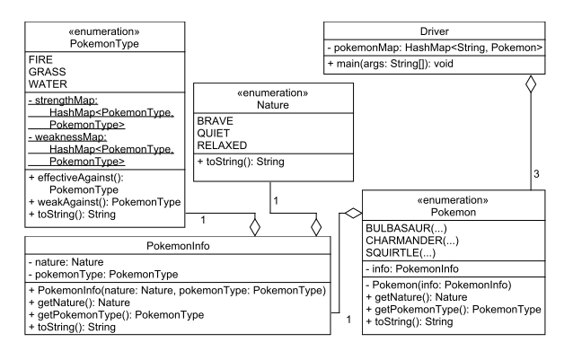

实验八：HashMaps, 枚举, Java集合框架
======

# 介绍
在本实验中，你将实验使用Java的HashMaps和枚举数据类型。你将实现一些不同的枚举类，其中一个以定制类作为值。在Driver类中，你将创建几个不同的HashMaps - 其中一个将字符串映射到枚举数据类型，另一个将枚举类型的不同值之间进行映射。另外，你的实现将对一个HashMap进行迭代。

# 学习目标
完成本实验后，你应该能够：
1. 创建一个枚举数据类型
2. 创建并添加项目到一个HashMap
3. 使用Key从HashMap中取值
4. 迭代一个HashMap并打印信息

# 准备
将现有的lab8实现导入到你的eclipse工作区，
- 下载[lab8](lab8.zip)实现
- 在Eclipse中，选择*File/Import*
- 选择*General/Existing projects into worksapce*，点击*Next*
- 选择*Select archive file*，导航到lab8.zip文件，点击*Next*

# UML设计 - 表示不同的Pokemon
下面是本实验的UML表示，你的任务是实现这些类，并编写相应的单元测试。


本实验中我们只会用到如下Pokemon：*Bulbasaur（妙蛙种子）*，*Charmander（小火龙）*，*Squirtle（杰尼龟）*。pokemonMap这个HashMap中用到的keys分别是Pokemon名字的三字母简写：*BLB*，*CHR*，和*SQR*。本实验中三个Pokemon的属性表示如下：
- BULBASAUR：性格 - RELAXED，类型 - GRASS
- CHARMANDER：性格 - BRAVE，类型 - FIRE
- SQUIRTLE：性格 - QUIET，类型 - WATER
Pokeman的类型对其战斗力有很大影响，某些类型之间有相互克制作用，如下表定义：

| 类型 | 克制类型 |
|:-----:|:--------| 
| Fire | Grass |
| Water | Fire |
| Grass | Water |
表1：类型克制表

# 实验8的一般步骤
### 步骤1
如果还未创建，请先按UML所示创建*Nature*，*Pokemon*，*PokemonType*，*PokemonInfo*和*Driver*类，
- 确保类名和UML一致
- 你必须使用缺省包，也就是说包字段必须是空

### 步骤2
为每个类实现属性和方法
- 我们建议你从类分级的底部开始：先实现不依赖于其它类的类
- 实例变量和方法名的命名按照UML所示
- 除UML规范以外，不要为类增加额外的功能
- 不要忘记增量添加注释文档！

### 步骤3
创建JUnit测试类对你的所有代码进行全面测试
- 确保所有功能正确
- 确保所有类和方法被测试覆盖。

# 实验8的具体说明
### Nature枚举
该枚举具有如下成员：*BRAVE*，*QUIET*，*RELAXED*。
- *toString()*：该方法返回特定枚举成员的小写名称

### PokemonType枚举
该枚举有如下成员：*FIRE*，*GRASS*，*WATER*。

PokemonType枚举类型包含所有可能Pokemon类型的一个子集（实验中我们只用了三个，实际上远不止这些）。

如前所述，Pokemon的类型影响其战斗力，类型之间有相互克制关系。为了表达类型成员之间的弱/强相互克制关系，我们用两个HashMaps存储这些关系：*strengthMap*和*weaknessMap*。*strengthMap*表达某个类型和它强克制的类型之间的映射，*weaknessMap*表达某个类型和它弱克制的类型之间的关系。

为了只创建和填充这些maps一次，同时又能访问maps中的枚举成员，我们将对maps的引用标记为**静态static** - 这些引用也被标记为**final**，表明是常量不能修改。对*strengthMap*和*weaknessMap*的初始化应该在**静态初始化器static initiaizer**中完成。一个静态初始化器是一个代码块，类被Java加载时，其中的静态初始化器仅被运行一次。静态初始化器的执行在静态变量声明之后，其它代码初始化之前 - 你可以把它看成是类本身的构造函数，而不是单个类实例的构造函数。

因为静态初始化器只运行一次，也只是被Java内部调用，你无需像其它方法一样给它一个名称，因为它无法被其它代码所调用。一个静态初始化方法的例子如下：

```java
class Foo // Some class
{
    static { // This is the static initializer for class Foo
    {
        . . . // Code goes here
    }
}
```

HashMaps中的映射关系见上面的表1.

要实现的实例方法如下：

- *effectiveAgainst()*：该方法返回这个特定PokemonType所克制的PokemonType。
- *weakAgainst()*：该方法返回这个特定PokenmonType所弱克制的PokemonType。
- *toString()*：该方法返回特定枚举成员的小写名称。

### PokemonInfo类
该类包含某个特定Pokemon的信息，包括：Pokemon的性格*Nature*和类型*PokemonType*。
- *Pokemon constructor*：该构造函数接受一个*Nature*输入和一个*PokemonType*输入，并将它们赋予恰当的实例变量，
- *getNature()*：该方法返回某个*PokemonInfo*实例的*Nature*，
- *getPokemonType()*：该方法返回某个*PokemonInfo*实例的*PokemonType*，
- *toString()*：该方法返回如下格式的*PokemonInfo*实例的信息：
```
a <NATURE> <POKEMON_TYPE> type
```
其中<NATURE>是实例中存储的*Nature*，<POKEMON_TYPE>是实例中存储的*PokemonType*。如果*Nature*是*BRAVE*，*PokemonType*是*WATER*，那么输出如下：
```
a brave water type
```

### Pokemon枚举类型
*Pokemon*枚举是所有可能*Pokemon*的一个子集，该枚举有如下成员：*BULBASAUR*，*CHARMANDER*和*SQUIRTLE*。
- *Pokemon constructor*：该构造函数接受一个*PokemonInfo*实例并存于恰当的实例变量，
- *getNature()*:该方法返回*Pokemon*的*Nature*，
- *getPokemonType()*：该方法返回*Pokemon*的*PokemonType*，
- *toString()*：该方法返回*Pokemon*的描述字符串，格式如下：
```
<NAME>: a <NATURE> <POKEMON_TYPE> type
```
其中<*NAME*>是Pokemon的名称，第一个字母大写，其余小写，<*NATURE*>和<*POKEMON_TYPE*>已经在上面*Pokemon*枚举中描述过。对于一个Pokemon *BULBASAUR*，*QUIET Nature*，*PokemonType GRASS*，返回字符串如下：
```
Bulbasaur: a quiet grass type
```

### Driver类
Driver类创建和初始化一个HashMap，key为字符串，value为*Pokemon*枚举。它也提示用户是对HashMap中的单个还是一组Pokemon输出信息。如果用户选择单个，那么程序就输出指定Pokemon的信息，如果用不选择一组，那么HashMap中的所有Pokemon的信息都被输出。
- 主菜单
```
Professor Oak, the Pokemon professor, presents you with three pokeballs and tells you that you can choose one as your first Pokemon!
Please select an option:
1: Choose a Pokemon
2: List all Pokemon
```
- Pokemon选择菜单
```
Please choose from the folloing Pokemon: [SQR, BLB, CHR]
```
**注意**：集合是无序的，所以Pokemon列表可是任意顺序。

请使用*BufferedReader*接收用户输入。你的代码需要处理用户输入的任何选择，例如，非1和2的数字，字母，未列出的Pokemon，等等。如果输入不正确，你的程序必须重新提示用户输入，直到输入正确。

一旦获得了用户的所有必要输入，你的程序必须打印选定（或所有）Pokemon的信息，最后退出。

### 交互例子
```
Professor Qak, the Pokemon professor, presents you with three pokeballs - and tells you that you can choose one as your first Pokemon!
Plese select an option:
1: Choose a Pokemon
2: List all Pokemon
1
Please choose from the following Pokemon: [SQR, BLB, CHR]
SQR
You choose Squirtle: a quiet water type.
Your water type Pokemon is weak against grass types and strong against fire types.
```

```
Professor Qak, the Pokemon professor, presents you with three pokeballs - and tells you that you can choose one as your first Pokemon!
Plese select an option:
1: Choose a Pokemon
2: List all Pokemon
2
SQR - Squirtle: a quiet water type.
BLB - Bulbasaur: a relaxed grass type.
CHR - Charmander: a brave fire type.
```

# 最后步骤

### 步骤1
使用Eclipse生成Javadoc
- 选择*Project/Generate Javadoc...*
- 确保你的项目被选中，包括所有的Java文件
- 选择*Private*可见性
- 使用缺省的目标目录
- 点击*Finish*


### 步骤2
在Eclipse或者你常用的浏览器中打开lab8/doc/index.html文件。 确保Javadoc中包含你的类，所有的方法包含必要的Javadoc文档。

# 提示
所有枚举类型都自动提供一个*name()*实例方法，它返回一个枚举值的String描述。特别的，它和你用来描述枚举值的字符串一样。

