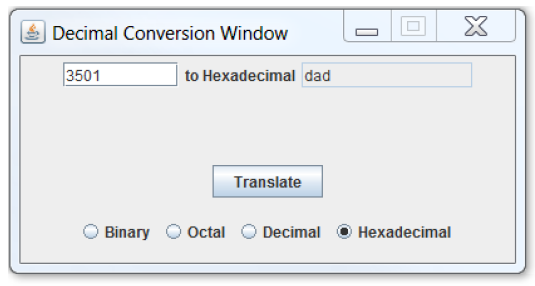
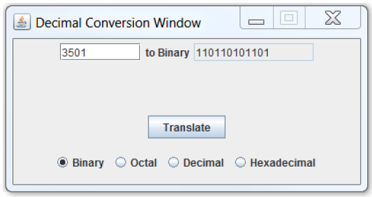
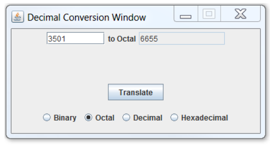
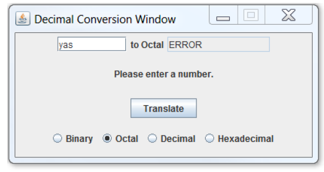
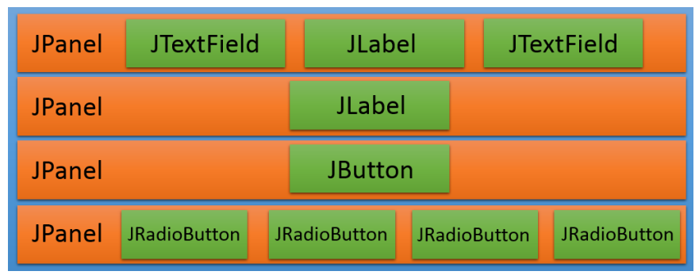

实验九：GUI基础
======

# 介绍
在本实验中，你将试验Java的图形用户接口（GUI）。GUIs以一组分级的图形组件定义（这里的分级是 *has-a* 的意思）。在分级的顶部是其它组件的容器组件 - 在本案中，该组件是**JFrame**。其它组件，例如**JButton**，**JLabel**，**JTextField**和**JRadioButton**，是提供用户交互的GUI组件。**JPanel**也是包含其它组件的组件，让我们能以方便和逻辑的方式将不同GUI部分组织在一起。

本实验中你的任务是为一个简单的数制转换计算机创建一个GUI。这个GUI会给用户提供一个单个文本框，可以输入一个操作数（值），一组单选按钮，可选择操作类型。执行计算之后，GUI会将结果显示在一个不可编辑的文本字段中。

# 学习目标
完成本实验后，你应该能够实现一个简单的GUI，通过：
1. 创建一个窗口组件
2. 在窗口中添加各种组件
3. 根据指定逻辑响应窗口事件

# 准备
将现有的lab9实现导入到你的eclipse工作区，
- 下载[lab9](lab9.zip)实现
- 在Eclipse中，选择*File/Import*
- 选择*General/Existing projects into worksapce*，点击*Next*
- 选择*Select archive file*，导航到lab9.zip文件，点击*Next*

# 简单数制转换器
下面是我们将创建的计算器的GUI展示，用户在第一个文本框中输入一个十进制数字，用户有四种数制转换方式可以选择：二进制binary，八进制octal，十进制decimal和十六进制hexadecimal。当程序第一次启动时，二进制按钮应当被选中。

当用户点击*Translate*按钮，根据用户选择的目标数制，结果应该被显示在"to XXXX"的右边，其中XXXX表示用户选择的目标数制。

在下面的例子中，用户在输入框中输入了值*3501*，选择十六进制*Hexadecimal*并点击*Translate*，GUI将呈现把十进制数3501转换成十六进制后的结果： dad。注意结果使用小写字符。

同样，如果选择的是二进制，当用户点击*Translate*，GUI将呈现结果：*110110101101*。

最后，八进制结果是：*6655*。

如果用户输入无效值或者空值，再点击*Translate*，将会显示如下错误消息：

当用户关闭窗口，则程序终止退出。

# GUI组织

我们的计算器以一组4个水平行的方式组织，如下所示：

行都有一个**JPanel**包装，包含如下信息：
1. 操作数，操作符和结果
2. 一个错误消息（可以为空）
3. 一个*Translate*按钮
4. 一组操作符选择单选按钮

在**JFrame**中，我们使用维度为 4x0 的**GridLayout**来组织四个**JPanel**。

在你的GUI设计中，使用如下组件：
- **JFrame**作为视窗
- **JPanel**作为子面板
- **JButton**作为按钮
- **JTextField**实例作为*可编辑的*文本输入框，和*不可编辑的*文本框
- **JLabel**显示目标转换数值和错误消息
- **ButtonGroup**告知Java视窗，一次只能选择其中的一个操作符按钮
- **JRadioButton**实例作为单选按钮

# 实验9：具体说明
lab9.zip中仅提供了一个称为CalculatorFrame.java的脚手架类。

### 步骤1
根据注释中的说明修改类
- 在**CalculatorFrame**类中，仅有一个构造函数和*main()*方法
- 不要修改类名
- 必须使用缺省包，也就是说包声明部分为空
- 不要改变实例变量和方法名
- 不要为类添加额外的新方法
- 不要忘记增量添加文档

### 步骤2
充分测试你的程序和数制转换功能
- 确保所有转换正确
- 确保输入错误有恰当的错误提示
- 本实验你无需写单元测试，所有测试通过交互界面完成。

# 提示
- 记住你的类是一个**JFrame**，也就是说你的类继承**JFrame**的所有可继承方法，这就是为什么我们要在Calculator Frame的构造函数中调用*super()*方法。
- 你的构造函数应当创建所有的GUI组件，将它们串联组织起来，并附加响应的事件监听器**ActionListeners**。
- main方法只需创建一个**CalculatorFrame**实例，然后不需要做其它事。
- 实例变量对所有的内部匿名类"可见"。
- 关于如何获知一个单选按钮被选中与否，请参考**JRadioButton** API。
- 关于如何改变一个标签中的文本，请参考**JLabel** API。
- 关于如何将一个文本字段标记为不可编辑，请参考**JTextField** API。
- 网上有数制转换工具，可用于核对你的计算结果。
- 理解**Integer.toString()**方法对你的实现有很大帮助。

# 最后步骤

### 步骤1
使用Eclipse生成Javadoc
- 选择*Project/Generate Javadoc...*
- 确保你的项目被选中，包括所有的Java文件
- 选择*Private*可见性
- 使用缺省的目标目录
- 点击*Finish*

### 步骤2
在Eclipse或者你常用的浏览器中打开lab9/doc/index.html文件。 确保Javadoc中包含你的类，所有的方法包含必要的Javadoc文档。

# 提示
所有枚举类型都自动提供一个*name()*实例方法，它返回一个枚举值的String描述。特别的，它和你用来描述枚举值的字符串一样。

