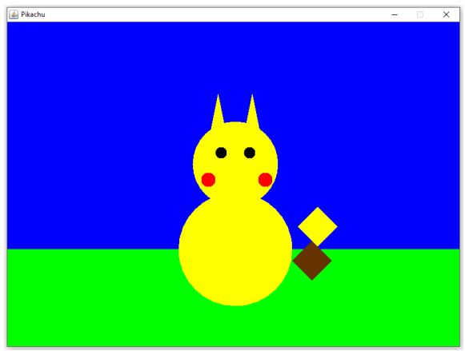
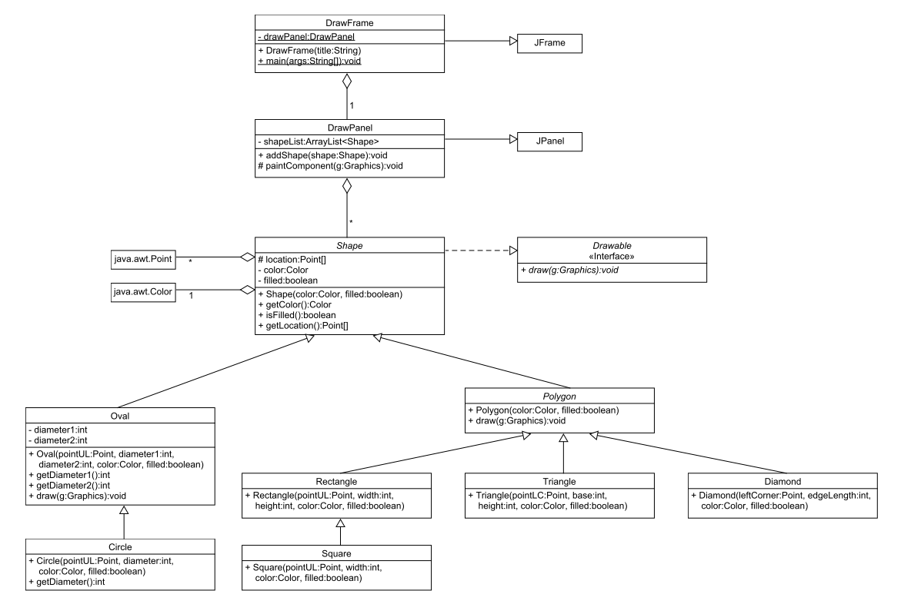

实验十：Java绘图
======

# 介绍
本实验带你体验Java图形绘制。绘图知识能让你用形状和颜色定制你的GUI。在学习了GUI组件（**JButton**，**JLabel**，**JTextField**）的基础上，增加绘图技能，能让你在开发方面有更大发挥空间！
本实验你的任务是绘制一组图形来创建皮卡丘图案。

# 学习目标
完成本实验后，你应该能够实现一个简单的GUI，通过：
1. 创建一个窗口组件
2. 在窗口中添加图形组件
3. 定制这些组件的大小，位置和颜色，最终构成一个有组织的图案

# 准备
将现有的lab10实现导入到你的eclipse工作区，
- 下载[lab10](lab10.zip)实现
- 在Eclipse中，选择*File/Import*
- 选择*General/Existing projects into worksapce*，点击*Next*
- 选择*Select archive file*，导航到lab10.zip文件，点击*Finish*

# 图案
下面是即将模仿绘制的图案演示：

这个图案除关闭窗口外，并不提供用户交互方式
特别的，图案由下面的组件构成：
- 两个**Circle**或者**Oval**实例，代表身体和头部
- 两个**Circle**实例，代表眼睛
- 两个**Circle**实例，代表脸颊
- 两个**Triangle**实例，代表耳朵
- 两个**Diamond**实例，代表尾巴
- 两个**Rectangle**实例，代表天空和大地
你无需做到和样例完全匹配 - 在选择大小和颜色时，你可以加点自己的创意。但是，每个图形必须要有，最后绘制的图案要和样例近似。请注意有些图形是重叠的，也就是说添加图形的顺序是非常重要的。

# UML

# 实验步骤
UML中展示的所有类在lab10.zip中都有提供。

### 步骤1
确保UML中规定的变量和方法都被实现
- 不要改变zip文件中的类名
- 必须用缺省包，也就是说包声明必须为空
- 不要改变提供的变量和方法名
- 确保所有的方法有完整文档

### 步骤2
根据注释中的TODO指令修改代码

### 步骤3
实现JUnit单元测试，检查Shape类的非绘图部分。例如，验证创建的**Circle**实例应该具有正确的圆心和半径。

# 注意
- DrawPanel是唯一提供*paintComponent()*方法的类，各种形状能被绘制出来，是因为它们的*draw()*方法被*paintComponent()*调用了。
- 如果我们提供的代码有bug，请修复。如果我们的代码缺失JavaDoc，请完善。如果代码有风格问题，请修复。记住在真实世界中，代码总有这样那样的问题，没有完美的。

# 最后步骤

### 步骤1
使用Eclipse生成Javadoc
- 选择*Project/Generate Javadoc...*
- 确保你的项目被选中，包括所有的Java文件
- 选择*Private*可见性
- 使用缺省的目标目录
- 点击*Finish*

### 步骤2
在Eclipse或者你常用的浏览器中打开lab10/doc/index.html文件。 确保Javadoc中包含你的类，所有的方法包含必要的Javadoc文档。

