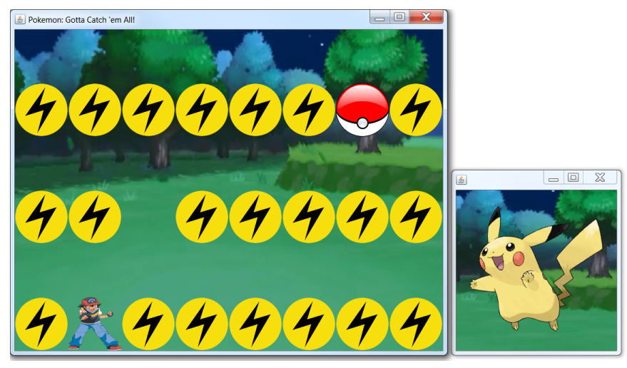
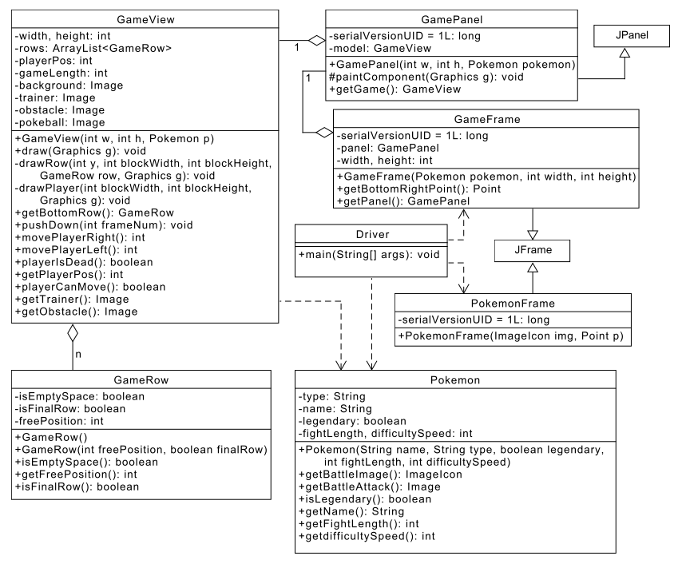

实验十一：交互式图形
======

# 介绍
在本实验中，你将实验使用Java创建图形。特别的，你将实验使用**KeyListeners**和**KeyEvents**来响应键盘事件。
你将完成一个游戏，游戏中玩家要通过按右和左箭头在一个移动的迷宫中移动。玩家必须在屏幕的空区域，如果玩家被一个移动的墙捕获，那么玩家就输了。如果玩家拿到精灵球并到达终点，那么玩家就赢了。

# 学习目标
完成本实验后，你应该能够实现一个简单的GUI，通过：
1. 创建事件驱动图形
2. 使用**KeyListener**根据**KeyEvents**更新图形
3. 为完成本地实验阅读已有代码和文档

# 准备
将现有的lab11实现导入到你的eclipse工作区，
- 下载[lab11](lab11.zip)实现
- 在Eclipse中，选择*File/Import*
- 选择*General/Existing projects into worksapce*，点击*Next*
- 选择*Select archive file*，导航到lab11.zip文件，点击*Finish*

# 口袋妖怪游戏
下面是我们将为游戏创建的图形用户接口。

小智(Ash Ketchum，戴红色帽子和穿蓝色裤子的人)表示玩家。带电符号的行表示玩家不能穿越的墙。这些墙从上往下移动，速度逐渐变慢。目标是在墙壁将玩家捕获前将玩家移动到安全区，并且将拿到迷宫尾部的。玩法就是使用键盘的向左和向右键将玩家向左和向右移动。
注意：玩家在窗口边上可以快速从一端移动到另一端。

# UML设计

- **Driver**，该类创建JOptionPane用户接口，用于选择不同的游戏困难度。然后Driver创建适当的Pokemon对象，PokemonFrame和GameFrame。游戏然后在一个循环中运行，直到结束，然后退出，退出时显示一个最后的JOptionPane。
- **GamePanel**，在GameFrame中的一个简单panel，用于显示GameView对象。
- **GameView**，该项目的主体部分。多个组件组合起来构成Pokemon游戏。该类用于创建和迷宫，玩家和移动相关的各个组件。你在该类中实现*movePlayerRight*和*movePlayerLeft*，还有*drawPlayer*，*drawRow*和*draw*。
- **GameRow**，该类表示游戏中迷宫的一行。该行既可以是完全空的，或者完全填满障碍物只留一个玩家可以安全通过的出口。
- **Pokemon**，一个表示在游戏中可被捕获的Pokemon，也用于处理级别，如游戏长度，难度，和为每个Pokemon准备图形资源。
- **PokemonFrame**，一个显示你尝试捕获的Pokemon的frame。该frame被创建放置的位置取决于GameFrame的位置。
- **GameFrame**，放置gamePanel和整个游戏的main frame。该frame负责处理来自用户的键盘输入，并在屏幕上移动玩家。你需要实现一个*KeyListener*来完成该任务。

# 实验说明
UML中展示的所有类在lab11.zip中都有提供。

### 说明1
大部分类都已经被实现，你需要实现绘图，而不是游戏的逻辑部分。但是，你需要分析和理解游戏逻辑来实现绘图。
- **Driver**，**GamePanel**，**GameRow**，**Pokemon**和**PokemonFrame**已经被完整实现。在动手前先阅读和理解这些类。
- 实现**GameFrame**中的**KeyListener**类
    - 当你实现**KeyListener**，Java要求你为三种事件类型创建处理器方法。因为你只需要一种事件类型，可以将其它两个方法留空。
    - 你可以实现一个**KeyAdapter**，这样你只需要重载一个感兴趣的方法。
- 完成**GameView**的实现
    - 大部分逻辑都在该类中。动手前分析和理解其中的代码先。

### 说明1
除了我们规定的，不要为类添加功能

### 说明3
不要忘记添加注释

### 说明4
本实现中你无需实现单元测试。相反，你应当手工交互方式测试代码。确保测试所有可能的条件，确保玩家移动和游戏规则实现正确。

# 最后步骤

### 步骤1
使用Eclipse生成Javadoc
- 选择*Project/Generate Javadoc...*
- 确保你的项目被选中，包括所有的Java文件
- 选择*Private*可见性
- 使用缺省的目标目录
- 点击*Finish*

### 步骤2
在Eclipse或者你常用的浏览器中打开lab11/doc/index.html文件。 确保Javadoc中包含你的类，所有的方法包含必要的Javadoc文档。

