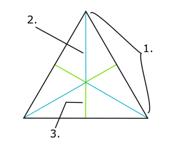
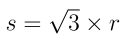
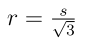
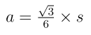
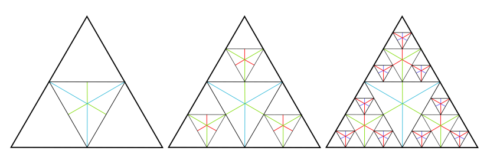
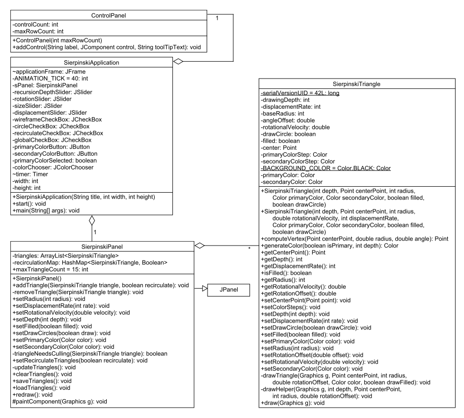
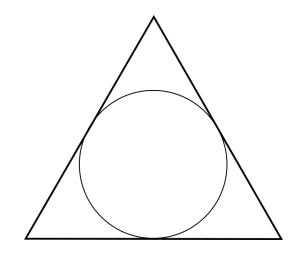
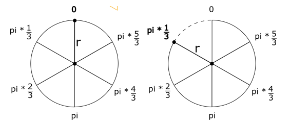

实验十三：递归
======

# 介绍
在本项目中，我们将采用递归逻辑创建一个分形三角，也就是所谓的谢尔宾斯基三角形。递归在图形之外领域有很多实践用途，但是分形提供一种可视化递归的最佳方式。

# 学习目标
完成本实验后，你应该能够：
1. 为完成实现阅读代码和文档
2. 定义递归结束条件和递归步骤
3. 正确的以递归方式调用方法
4. 为动画目的创建一个时钟

# 准备
将现有的lab13实现导入到你的eclipse工作区，
- 下载[lab13](lab13.zip)实现
- 在Eclipse中，选择*File/Import*
- 选择*General/Existing projects into worksapce*，点击*Next*
- 选择*Select archive file*，导航到lab13.zip文件，点击*Finish*

# 谢尔宾斯基三角形
谢尔宾斯基三角形是一个分形和吸引人的等边三角形，进一步被递归细分为更小的等边三角线，细节请参考[wiki](https://en.wikipedia.org/wiki/Sierpinski_triangle)。

对于本实验，你必须知道等边三角形的一些属性：

1. 三角形的一条边*s*
2. 三角形的半径*r*
3. 三角形的边心距*a*

下面的关系可能对你有用：

1. 给定一个半径，一条边等于：

2. 半径等于：

3. 边心距等于：

谢尔宾斯基三角形的最初三次迭代如下（半径和边心距也显示出来了 - 你的实现不需要显示出来）：

黑色线段除外，相同颜色的线段都是等长的。注意，围绕着一个较大三角形的三个较小三角形的半径等于较大三角形的边心距。

另外，较小三角形的中心点到较大三角形的中心点的距离等于较大三角形边心距的两倍。

谢尔宾斯基三角形可以通过如下方式构造，先画一个基准方向的等边三角形（底边平躺，一个顶点向上）。画完基准三角形后，递归画更小的三角形，每次将方向相对基准调整180度。可以这样做：

1. 调用*SierpinskiTriangle*类的*draw()*方法。
2. 画出基准三角形（底边平躺，一个顶点向上）。
3. 以正确的参数调用*drawHelper()*方法，在正确的方向上，在正确的位置，半径由上面的公式计算出来，画一个三角形（一个顶点朝下）。
4. 在*drawHelper()*方法中，计算三角形的边心距。
5. 计算三个围绕三角形的中心点（记住这些三角形都是等边的，所以这些三角形的中心点会以120度均分布在中央三角形的周围）。
6. 回到步骤3画出三个围绕三角形
7. 画出当前三角形

# UML

# 实验说明
UML中展示的所有类在lab12.zip中都有提供。
1. 仔细阅读现有类，实现其中标记TODO的地方。
2. 除了我们规定之外，不要为类添加额外功能。
3. 不要忘记文档！

### SierpinskiApplication类
- SierpinskiApplication() - 在构造函数的底部需要创建一个新的javax.swing.Timer对象，使用*SierpinskiApplication.ANIMATION_TICK*作为延迟值。一个调用*SierpinskiPanel*实例中代码的ActionListener应当驱动一个动画步（三角形移动并在屏幕上重绘）。

### SierpinskiTriangle类
- *draw(Graphics g)* - 该方法负责实际在屏幕上绘制谢尔宾斯基三角形，使用提供的Graphics对象。使用颜色*SierpinsikiTriangle.BACKGROUND_COLOR*，画出基准三角形。然后，使用恰当的参数调用drawHelper()，在基准三角形上方，画出第一个内部三角形。 
- *drawHelper(Graphics g, int depth, Point centerPoint, int radis, double rotationOffset)* - 这是一个递归方法，根据给定参数画一个三角形，然后调用自身绘制围绕的三角形。
该方法接受如下参数：
1. g - 用于绘图的Graphics对象。
2. depth - 当前递归深度。最初调用该方法时深度等于三角形的深度字段的值。
3. centerPoint - 要画出的三角形的中心点。
4. radius - 要画出的三角形的半径。
5. rotationOffset - 要画的三角形的角偏移。
每次调用该方法，使用*generateColor()*返回的颜色来画三角形（三角形使用基色画出）。
如果*drawCircle*被设置成true，你需要在当前三角形的顶部画一个内接圆形；使用*generateColor()*方法返回的颜色绘制（圆形用合成色绘制）。
内接圆形看似如下：

*SierpinskiTriangle*类有一个称为*computeVertex()*的助手方法，接受一个中心点，一个半径和一个角度作为参数。该方法开始时在指定中心点上方*radius*单位处生成一个点，后续点依次围绕中心点旋转一个角度。

### SierpinskiPanel类
- *updateTriangles()* - 该方法负责计算每个三角形的新位置和方向。你需要实现该方法，在每个动画步让三角形的中心点和旋转偏移都正确更新。

# 最后步骤

### 步骤1
使用Eclipse生成Javadoc
- 选择*Project/Generate Javadoc...*
- 确保你的项目被选中，包括所有的Java文件
- 选择*Private*可见性
- 使用缺省的目标目录
- 点击*Finish*

### 步骤2
在Eclipse或者你常用的浏览器中打开lab13/doc/index.html文件。 确保Javadoc中包含你的类，所有的方法包含必要的Javadoc文档。

