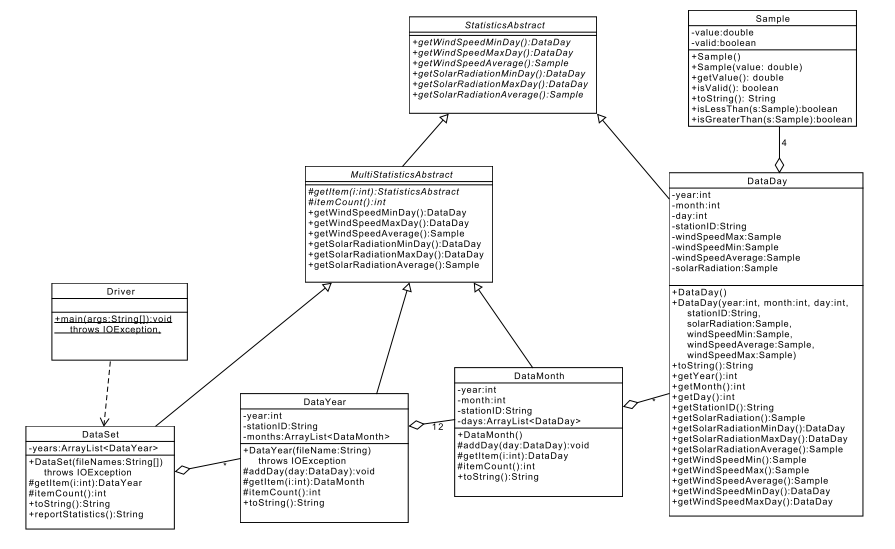

项目2：类抽象
======

# 介绍
在项目1中，你接触到了俄克拉荷马州的Mesonet的一组数据，这些数据比较"干净"（虽然有些样本是无效的），你计算的也仅是一月内的统计。在该项目中，我们将增加多个观测站、多月和多年来扩展数据集。另外，数据也不太"干净" -- 某些月份内的某类样本都是无效的。你的最后产品将能够报告一个观测站和一年的统计，或者多个观测站和多年的数据。

# 学习目标
完成本项目后，你应该能够：
1. 从目录中加载一组文件
2. 以恰当的方式创建和使用抽象对象
3. 在代码中使用多态
4. 继续实践针对Javadoc和单元测试的好的编码实践

# 成功策略
- 不要修改我们提供的规范。在目前阶段，我们规定所有的实例变量和所需的方法。
- 当你实现一个类或者方法，请专注于那个类或者方法要做的事情，请尽可能的将大问题先抛诸脑后。
- 我们鼓励你和同伴紧密合作，尽可能沟通讨论。
- 尽早开始项目，在大多数情况下，本项目不可能在一两天内完成。
- 以增量方法实现和测试你的项目组件，不要等整个项目都实现完成了再开始测试流程。
- 以增量方式写文档，不要等到整个项目都实现完成再补文档，在实现代码之前先写文档是一个好的实践。

# 准备工作
1. 将project1的实现拷贝到project2。
2. 下载数据文件[project2-data.zip](project2-data.zip)
3. 将数据拷贝到你的project2工作区，年目录应该放于project2/data/

# 类设计
在项目1中，如**DataDay**类所示，一个Mesonet监测站每天提供一组数据。排序后的每日数据被存入**DataMonth**类，该类让我们能够根据每日数据计算汇总。在本项目中，我们将引入多年的数据集。我们希望年的统计和月统计类似：一年的最大风速就是该年月风速的最大值，多年的平均风速就是对多年的风速求平均。这些功能的类似性可以用类继承来表达。例如，对子项目计算平均的实现可以被所有具有子项目的类所共享。

下面是完整的关键类的UML图：



这个高层设计的关键点：
- **StatisticsAbstract**抽象类表示**任何可以计算统计**的对象。继承的类是**DataDay**，**DataMonth**，**DataYear**和**DataSet**。例如，所有这些具体类必须提供一个计算最小太阳辐射的方法。如果要计算月的最小太阳辐射值，则可以通过查看这个月内每天的最小太阳辐射值来计算。
- **DataDay**类继承自**StatisticsAbstract**类
- **MultiStatisticsAbstract**抽象类表示**任何可以通过子对象计算统计**的对象。**DataMonth**，**DataYear**和**DataSet**都是从这个抽象类继承下来的具体类。对于他们的任何一个实例，计算统计（平均、最小和最大）的过程都是相同的。因此，统计计算的实现只需一个 -- 在**MultiStatisticsAbstract**抽象类中。
最为计算最大最小统计的一部分，我们将跟踪最大和最小值对应的天。因此，*getSolarRadiationMinDay*将返回最小值对应的那一天。如果你需要进一步了解最小值，可以从返回的*DataDay*对象直接获得。
- **DataMonth**，**DataYear**和**DataSet**每个都包含一个**ArrayList**子对象。例如，一个**DataYear**包含也仅包含12个*DataMonth*对象。

# 项目步骤
请从项目1的实现开始，下面是关键性的改变：

### 步骤1
更新项目1中的**Sample**类
- 增加*isLessThan(Sample s)*方法，该方法有助于不同Sample之间的比较，该方法的行为可用下表定义：

| this | s | 返回值 |
|:---:|:-----|:-------|
| 5   | 7    | true   |
| 5   | 5    | false  |
| 5   | 3.2  | false  |
| 5   | invalid | true |
| invalid | 3.7 | false |
| invalid | invalid | true |

- 增加*isGreaterThan(Sample s)方法，该方法的行为定义如下表：

| this | s | 返回值 |
|:---:|:-----|:-------|
| 5   | 7    | false   |
| 5   | 5    | false  |
| 5   | 3.2  | true  |
| 5   | invalid | true |
| invalid | 3.7 | false |
| invalid | invalid | true |

### 步骤2
在**SampleTest**类中实现对**Sample**类的单元测试，关注对新方法的单元测试（保留你的老单元测试）。

### 步骤3
查看然后完成**StatisticsAbstract**类的实现，该超类定义所有可以计算统计的类的公共行为。

### 步骤4
重构你的**DataDay**实现，存放单个监测站和单日的信息：
- 数据格式没有变化
- 创建一个新的缺省构造函数
```java
   public DataDay()
```
该构造函数创建未经初始化（day，month，year和stationID都未初始化）和包含无效样本的天(day)。
- 实现超类所需的抽象方法，注意
    - 某些方法引用一个样本的最小和最大值（例如solarRadiation)，因为一天内solarRatiation仅有一个样本，它既是最大值也是最小值。
    - 某些方法必须返回最小或者最大值对应的那天，这里只能返回一天。

### 步骤5
在**DataDayTest**类中为**DataDay**类书写单元测试，确保覆盖新方法。

### 步骤6
创建一个称为**MultiStatisticsAbstract**的超类，它对**StatisticsAbstract**对象数组计算统计。
- 提供方法对一组对象计算太阳辐射和风速，下面是一些注意点：
    - *itemCount()*方法可用于获得子对象的数量；
    - 单个子对象可用*getItem()*方法获取
    - 有可能一个对象是没有子对象的，或者子对象的样本对于某个属性都是无效的。在这些情况下，min/max方法应当返回一个无效的**DataDay**对象。另外，平均方法应当返回一个无效的样本对象。

### 步骤7
重构你的**DataMonth**类
- 一个**DataMonth**对象有一组**DataDay**对象组成
- 提供一个将天添加到月的方法（称为*addDay()*），对象实例包含对应的month，year和statiionID，在天被加到月中时，这些信息可以被取出。
- 注意文件加载功能已经从该类移植到**DataYear**中
- *toString()*应当输出如下格式的信息： TISH station for November of 2015：
```
2015 - 11, TISH: Wind = [0.0000, 8.9807, 28.8100]，Solar Radiation = [0.9000, 8.8883, 15.2500]
```
HINT station for February of 2014：
```
0000 - 00, null: Wind = [invalid, invalid, invalid], Solar Radiation = [invalid, invalid, invalid]
```

### 步骤8
为**DataMonthTest**类创建JUnit单元测试

### 步骤9
创建一个称为**DataYear**的类，表示给定观测站和年的所有月份数据。
- 对象有12月的一个**ArrayList**组成
- 构造函数以一个**String**作为输入参数，表示含有整年数据的文件名。
- *toString()*方法应当输出如下格式的信息： TISH station for 2015：
```
2015, TISH: Wind = [0.0000, 7.8934, 40.5300], Solar Radiation = [0.4000, 15.7975, 30.3500]
```
HINT station for 2013:
```
2013, HINT: Wind = [0.0700, 12.1837, 39.1700], Solar Radiation = [1.7500, 18.3217, 31.2500]
```

### 步骤10
创建一个称为**DataYearTest**的单元测试类

### 步骤11
**DataSet**类表示多个观测站和多年的数据。
- 该类的一个构造函数必须：
    - 以一个字符串数组作为输入，每个表示要加载的年份
- *toString()*方法应当输出如下格式的信息：TISH station for 2013, 2014和2015:
```
Data Set: Wind = [0.0000, 8.2617, 40.5300], Solar Radiation = [0.4000, 16.3488, 30.6400]
```
HINT station for 2013, 2014和2015:
```
Data Set: Wind = [0.0000, 12.0708, 41.0500], Solar Radiation = [0.4900, 17.6787, 31.2500]
```
- *reportStatistis()*方法应当返回描述如下信息的字符串，样例如下：
TISH station for 2013, 2014和2015（年份顺序在构造函数中指定）：
```
Max Wind Speed:
2015-12-27, TISH: Wind = [11.7300, 25.5100, 40.5300], Solar Radiation = 0.4000
Average Wind Speed:
8.2617
Min Wind Speed:
2013-06-08, TISH: Wind = [0.0000, 7.5200, 16.1300], Solar Radiation = 27.3400
Max Solar Radiation:
2013-06-02, TISH: Wind = [2.3800, 8.2800, 17.3600], Solar Radiation = 30.6400
Average Solar Radiation:
16.3488
Min Solar Radiation:
2015-12-27, TISH: Wind = [11.73--, 25.5100, 40.5300], Solar Radiation = 0.4000
```
HINT station for 2013, 2014和2015（年份顺序在构造函数中指定）：
```
Max Wind Speed:
2015-12-26, HINT: Wind = [1.5700, 20.3200, 41.0500], Solar Radiation = 0.4900
Average Wind Speed:
12.0708
Min Wind Speed:
2014-10-28, HINT: Wind = [0.0000, 9.6000, 23.3800], Solar Radiation = 13.1900
Max Solar Radiation:
2013-06-09, HINT: Wind = [1.1900, 6.9500, 18.7200], Solar Radiation = 31.2500
Average Solar Radiation:
17.6787
Min Solar Radiation:
2015-12-26, HINT: Wind = [1.5700, 20.3200, 41.0500], Solar Radiation = 0.4900
```

### 步骤12
创建一个称为**DataSetTest**的单元测试类

### 步骤13
创建一个**Driver**类，该类创建一个**DataSet**并调用*reportStatistics()。


#最后步骤
### 步骤1
使用Eclipse为你的所有类生成Javadoc，

### 步骤2
在Eclipse或者你常用的浏览器中打开project2/doc/index.html文件。 确保Javadoc中包含你的类（主要类和三个单元测试类），所有的方法包含必要的Javadoc文档。

# 注意
- 有多重方法定义一年的平均风速，在本项目中，我们将平均风速定义为一年12个月的平均值。
- 记住数组是从0索引开始的，月份是1索引开始的。

# 参考
- [Java API](https://docs.oracle.com/javase/8/docs/api/)
- 俄克拉荷马州的[Mesonet](http://www.mesonet.org)
- [Assert类API](http://junit.sourceforge.net/javadoc/org/junit/Assert.html)
- 一个[Junit Tutorial](https://dzone.com/articles/junit-tutorial-beginners)


