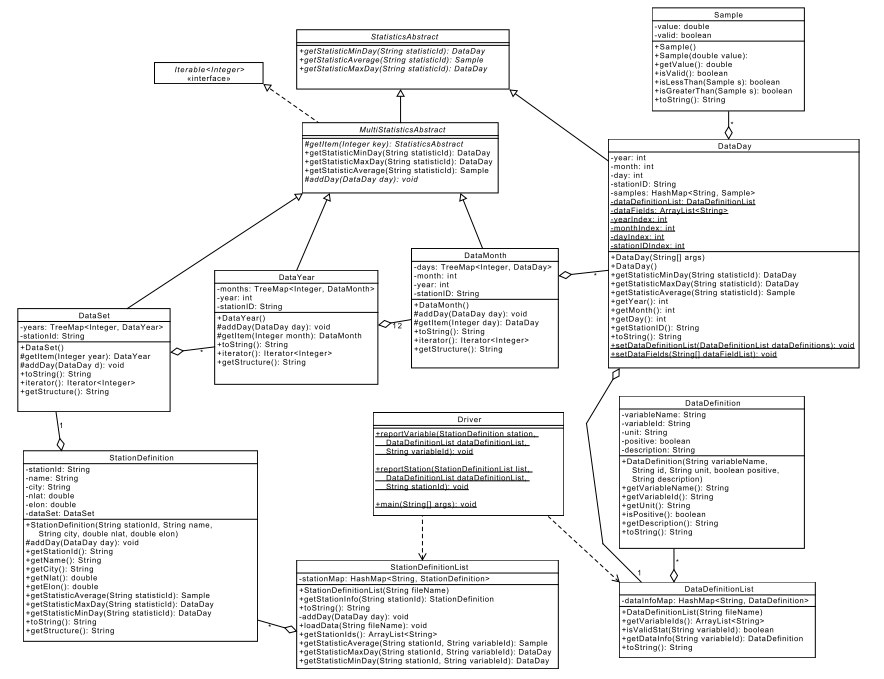

项目3：Java集合框架
======

# 介绍
在前面两个项目中，我们使用的是结构化的数据。特别的，你提前知道数据集中包含哪些监测站，对于每个监测站，你也提前知道哪些数据被记录了。在本项目中，这些都是提前不知道的。在运行时，你的程序将加载两个配置文件，配置文件描述：1）数据集包含哪些监测站，2）每个监测站记录了哪些数据。根据这些信息，你的程序将创建必要的数据结构来加载监测数据，并计算统计。

特别的，你的最后程序将：
1. 加载两个配置文件，描述监测站记录哪些数据，和有哪些监测站
2. 加载一年和多年的数据文件（每个文件包含所有监测站的数据）
3. 报告给定监测站的特定最小，最大和平均统计


# 学习目标
完成本项目后，你应该能够：
1. 使用**HashMaps**和**TreeMaps**，灵活存储和访问数据
2. 在无需提前知道数据具体细节的情况下，对数据进行读取和计算统计
3. 继续实践Javadoc和单元测试的好的编程实

# 成功策略
- UML规范了一些接口，请不要随便修改接口
- 当你实现一个类或者方法，请专注于那个类或者方法要做的事情，请尽可能的将大问题先抛诸脑后。
- 我们鼓励你和同伴紧密合作，尽可能沟通讨论。
- 尽早开始项目，在大多数情况下，本项目不可能在一两天内完成。
- 以增量方法实现和测试你的项目组件，不要等整个项目都实现完成了再开始测试流程。
- 以增量方式写文档，不要等到整个项目都实现完成再补文档，在实现代码**之前**先写文档是一个好的实践。

# 准备工作
1. 将project2的实现拷贝到project3。
2. 下载数据文件[project3-data.zip](project3-data.zip)
3. 将数据拷贝到你的project2工作区

# 输出样例
下面是由我们程序产生的几个样例输出（使用Driver.reportStation()）。你实现的输出应该类似。
对于Tishomingo检测站2015年的数据文件，ATOT，WSMX，WSPD和WSMN报告如下的Max，Avg和Min值。注意，对于WSMN，我们实际上计算的是Min，Max和average值。
```
Station: TISH, Tishomingo, Tishomingo
ATOT, Total Solar Radiation(mega Joules per square meter)
Max: 2015-06-09, TISH: 30.3500
Avg: 15.7975
Min: 2015-12-27, TISH: 0.4000
WSMX, Maximum Wind Speed(miles per hour)
Max: 2015-12-27, TISH: 40.5300
Avg: 16.4307
Min: 2015-06-09, TISH: 6.9100
WSPD, Average Wind Speed(miles per hour)
Max: 2015-12-27, TISH: 25.5100
Avg: 7.8934
Min: 2015-03-22, TISH: 3.0100
WSMN, Minimum Wind Speed(miles per hour)
Max: 2015-12-27, TISH: 11.7300
Avg: 1.6287
Min: 2015-01-13, TISH: 0.0000
```

对于Fittstown监测站2013，2014和2015年的数据文件，统计报告如下：
```
Station: FITT, Fittstown, Fittstown
ATOT, Total Solar Radiation(mega Joules per square meter)
Max: 2013-06-07, FITT: 31.4000
Avg: 16.1567
Min: 2015-12-27, FITT: 0.3600
WSMX, Maximum Wind Speed(miles per hour)
Max: 2013-05-29, FITT: 41.0300
Avg: 18.2879
Min: 2013-02-05, FITT: 6.7300
WSPD, Average Wind Speed(miles per hour)
Max: 2014-04-13, FITT: 21.6000
Avg: 9.8574
Min: 2015-01-01, FITT: 2.9900
WSMN, Minimum Wind Speed(miles per hour)
Max: 2013-04-08, FITT: 13.2700
Avg: 3.0825
Min: 2013-01-18, FITT: 0.0000
```

# 类设计
因为你的程序在编译时并不知道变量的具体表示，我们必须改变表示数据的方式。特别的，变量会用字符串*variableId*标识。在我们计算变量的最小，最大和平均值时，这些IDs将被用于查找相关的样本值。同样的，你的程序提前也不知道有哪些具体的监测站，它们在运行时被加载并动态获取。

下面是关键类的UML图，


实现细节：
- **DataDefinition*类表示单个变量的信息，包括名称，ID，一个文本描述和变量的单位，以及变量编码的信息是正的还是负的（后者是一个布尔）。toString()方法应当返回如下格式信息：
```
<ID>, <name> (<units>)
```
- **DataDefinitionList**类为单个监测站存储的所有可能的变量。构造函数会加载一个配置文件（DataTraslation.csv），文件的每一行编码一个变量。**HashMap**类用于variableId和对应**DataDefinition**对象之间的映射。toString()方法应当返回多行字符串，每一行包含一个DataDefinition字符串。
- **StationDefinition**类表示一个监测站的信息，包括其ID，名称和位置（经度和纬度），以及监测站的文本描述（监测站所在城市）。
单个**StationDefinition**对象有且仅有一个**DataSet**，*addDay()*方法用户将某天数据插入DataSet。
- **StationDefinitionList**类用一个**HashMap**来表示所有检测站的信息。构造函数会加载一个配置文件（geoinfo.csv），文件的每一行编码一个检测站。你可以安全忽略文件中的*datc*和*datd*列。
该类提供了一个**addDay()**助手方法，应当被**loadData()**方法使用。该方法用于将给定的天添加到恰当的监测站。
- 许多类实现一个*addDay(DataDay day)方法。在所有情况下，它表示将某天添加到数据结构中。在每种情况下，方法必须决定如何处理添加。对于YearlyData对象的情况，它必须先确定要要添加的月，然后再向这个月添加数据。
- 很多类实现*getStatisticAverage(String variableId)*方法，它返回一个**Sample**。**MultiStatisticsAbstract**为所有子类提供了实现。剩余的类(**DataDay**，**Station-Definition**和**StationDefinitionList**）都提供了各自的实现。
- *getStatisticMinDay()和*getStatisticMaxDay*和平均Average的处理行为类似。
- **MultiStatisticAbstract**的子类都用**TreeMap**表示他们的子对象。**TreeMap**的Keys是整数（对于**DataSet**对象对应于年，对于**Year**对象对应于月）。我们使用**TreeMap**是因为我们想保留健的顺序，可以有助我们快速查找变量的最大和最小值。另外，Map允许我们使用有意义的键（例如，实际的年份）。
- **MultiStatisticsAbstract**的每个子类实现**Iterable<Integer>**，使得MSA可以按子类的键进行迭代。迭代器必须以数字顺序对键进行迭代。提示，仔细查看**TreeMap**的API。
- **DataDay**类将不再为每个可能的**Sample**类型显示地表示变量。相反，该类使用一个HashMap将一个variableId映射到对应那个变量的一个**Sample**实例。
- **DataDay**类通过一组静态方法（*setDataDefinitionList()和*setDataFields()）设置**DataDefinitionList**和字段名。后者存储数据文件顶部包含的字段名列表。另外，后者也设置*yearIndex*，*monthIndex*，*dayIndex*和*stationIdIndex*类变量。
- **DataDay**构造函数将使用**DataDefinitionList**来确定哪些字段对应到必须表示为样本的变量。
- 继承自**MultiStatististicsAbstract**的任何类将不会显式地表示特定变量。相反，variableId将被用于查询变量值和计算变量的最小，最大和平均值。
- **DataSet**将包含特定检测站的所有年份。
- DataSet的*toString()*方法应当返回一个编码stationId的字符串：
```
Data Set: stationId
```
Days，Months和Years的*toString()*方法应当返回一个编码日期和stationId的字符串：
```
YYYY-MM-DD, stationId
```
其中MM和DD将别去掉，如果对象中不含month和day。
- *getStructure()*方法应当返回描述对象完整内容的一个字符串（对调试有用）。*DataSet.getStructure()*返回格式如下：
```
TS\n
```
其中TS是*DataSet.toString()*返回的字符串。该行之后跟随*DataYear.getStructure()*方法返回的一组字符串，每组格式如下：
```
\tYear: TS\n
```
其中TS是*DataYear.toString()*返回的字符串。该行之后跟随*DataMonth.getStructure()*方法返回的一组字符串，每组格式如下：
```
\t\tMonth: TS\n
```
其中TS是*DataMonth.toString()*返回的字符串。该行之后跟随如下格式一组字符串：
```
\t\t\tTS\n
```
其中TS是*DataDay.toString()*返回的字符串。
*getStructure()*主要用于测试目的，确保你加载的数据结构是正确的。

# 项目检查核对列表
从项目2开始实现项目3，以如下方式修改或者添加类：
1. 实现你的**DataDefinition**和**DataDefinitionList**类。使用*DataTranslation.csv*文件指导实现。
2. 实现**DataDefinitionListTest**类。
3. 实现你的**StationDefinition**和**StationDefinitionList**类。使用*geoinfo.csv*文件指导实现。
4. 实现**StationDefinitionListTest**类。
5. 根据UML更新你的**StatisticsAbstract**类。
6. 根据UML更新你的**DataDay**类。
7. 更新你的**DataDayTest**类测试新的实现类。
8. 根据UML规范更新**MultiStatisticsAbstract**类。
9. 修改**DataMonth**，**DataYear**和**DataSet**类。
10. 创建一个单元测试，加载变量列表，检测站列表和数据，然后仔细测试多个监测站和变量的最小，最大和平均统计。
11. 你的*Driver.main()*方法仅用于测试目的。该方法加载配置文件，一个或者多个数据文件，并输出结果。

# 假设
你可以做如下假定：
1. 数据集中所有检测站包含在geoinfo.csv文件中，文件中的列是预定义的（它们不会改变）。
2. 所有文件存在，并且是正确格式化的csv文件。
3. 数据文件包含如下列：YEAR，MONTH，DAY，STID。但是，它们可能出现在任意类。
4. 数据集文件中的所有变量值可以被解释为doubles。

# 注意
1. 数据文件中的第一行决定文件中的每个字段的字段名（每列是一个字段）。尽管这些列的大部分都是监测站测量的变量，但不是所有都是。在你的**DataDay**构造函数中，你应当仅包括和变量对应的字段样本，由*isValidStat()*方法确定。
2. *Boolean*类提供方法从文本解析出布尔值。


# 项目步骤


#最后步骤
### 步骤1
使用Eclipse为你的所有类生成Javadoc，

### 步骤2
在Eclipse或者你常用的浏览器中打开project3/doc/index.html文件。 确保Javadoc中包含你的类（主要类和三个单元测试类），所有的方法包含必要的Javadoc文档。

# 注意
- 有多重方法定义一年的平均风速，在本项目中，我们将平均风速定义为一年12个月的平均值。
- 记住数组是从0索引开始的，月份是1索引开始的。

# 参考
- [Java API](https://docs.oracle.com/javase/8/docs/api/)
- 俄克拉荷马州的[Mesonet](http://www.mesonet.org)
- [Assert类API](http://junit.sourceforge.net/javadoc/org/junit/Assert.html)
- 一个[Junit Tutorial](https://dzone.com/articles/junit-tutorial-beginners)


