项目4：图形用户接口
======

# 介绍
在前面的三个项目中，你专注于从文件读取数据，并用数据构造大而有效的表示。在本项目中，我们将专注于向用户表示这些数据，让用户能够探究和某个监测站、变量和年份关联的统计。
你在项目3中实现的数据加载和表示功能将作为本项目的基础（要做一些小调整）。你将增加一个图形用户接口，便于用户交互。
你最终的项目成果：
1. 加载描述监测站的测量变量和测量站组的文件。
2. 允许用户指定要加载的数据文件（允许用户加载多个文件）。
3. 允许用户选择感兴趣的监测站，变量和一组年份。
4. 报告检测站和统计出的详细信息，包括选定年份的选定统计的最小，最大和平均值。

# 学习目标
完成本项目后，你应该能够：
1. 为一个frame创建一个关联的菜单
2. 利用JLists，它可以给用户提供一组选项，允许用户选择一个或者多个选项
3. 创建一组部件能向用户展现文本数据
4. 创建监听器允许GUI响应用户输入
5. 持续实践编写Javadoc和单元测试的好实践

注意，本项目依赖于你阅读Java API文档和样例代码的能力。我们会给你一些好的提示，但是从根本上讲，你必须自己从文档中发掘所需的信息。


# 成功策略
- UML规范了你要实现的新类和新方法
- 当你实现一个类或者方法，请专注于那个类或者方法要做的事情，请尽可能的将大问题先抛诸脑后。
- 我们鼓励你和同伴紧密合作，尽可能沟通讨论。
- 尽早开始项目，在大多数情况下，本项目不可能在一两天内完成。
- 以增量方法实现和测试你的项目组件，不要等整个项目都实现完成了再开始测试流程。注意为GUI书写单元测试是非常挑战的，我们也并不要求你这样做，GUI界面测试还是通过手工搞定，但是，你可以为"后端代码"书写单元测试。
- 以增量方式写文档，不要等到整个项目都实现完成再补文档，在实现代码**之前**先写文档是一个好的实践。

# 准备工作
- 在Eclipse中，将你的*project3*目录拷贝到一个新的*project4*项目。在该项目中，你的数据应当位于*data*目录中。数据和上个项目是一样的。
- 下载[项目文件](project4.zip)。这个zip文件包含**WeatherFrame**类的部分实现和新版本的*geoinfo.csv*和*DataTranslation.csv*文件。将前者拷贝到你的*src*目录，数据文件拷贝到你的*data*目录。

# 交互样例
下面是一组我们实现的截屏，你实现的界面可能有所不同，但是功能必须是一致的，如下节所述。

当你的程序启动，它将马上加载监测站和变量配置文件，但不会加载数据文件。给定加载的信息，下面是最初的接口状态：

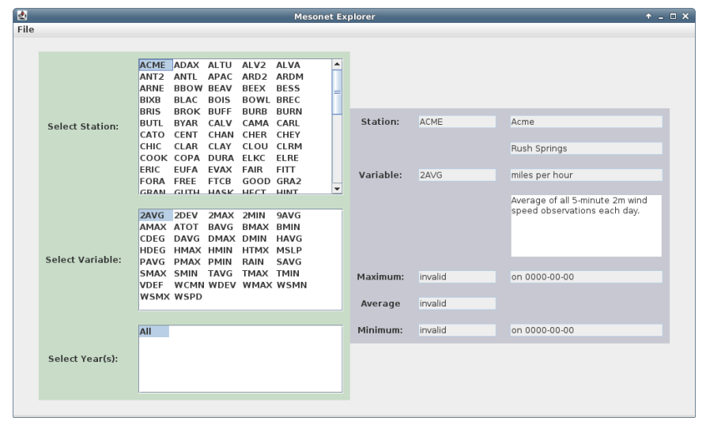

- 窗口的左上角是一个文件菜单
- 绿色区域包含三个列表接口，让用户可以选择一个stationId，一个变量和一或者多个年份。一次只能选择一个监测站和变量。但是，年份可以组合多选。
- 灰色区显示选中的监测站（ID，名称和城市），选中的变量（ID，单位和描述），和选中监测站、变量和年份的最大，平均和最小值。对于最大和最小值，相应的日期也会被显示。

当文件菜单被选中，完整菜单被打开：

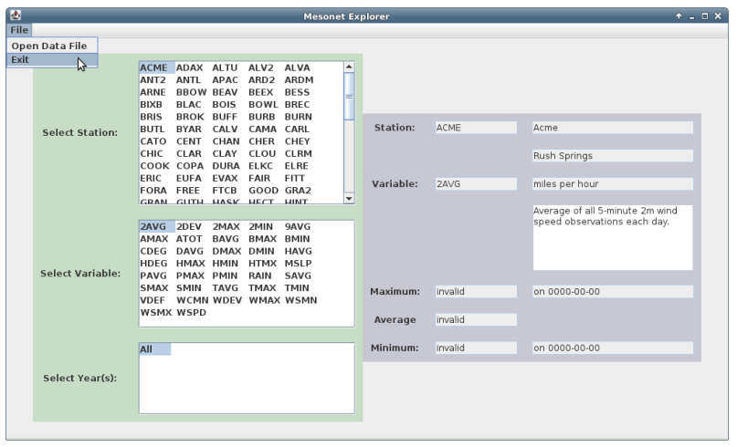

如果*Exit*被选中，程序就会退出（通过调用System.exit(0)）。
如果*Open Data File*被选中，则文件选择器会被打开：

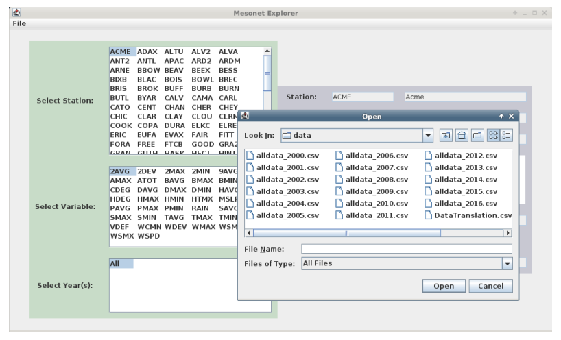

- 如果任意*allData*文件被选中，则你的程序将会开始加载数据。当数据被加载时，游标会变成一个动画时钟，表明你的程序正忙。实现做法是将Frame的游标cursor设置为：**Cursor.getPerdefinedCursor(Cursor.WAIT_CURSOR)**。
- 如果指定的文件不存在，你的程序应该打开一个错误窗口。实现做法是使用**JOptionPane.showMessageDialog()**。
- 如果在加载文件时出现异常，你的程序也应该打开一个出错窗口。

下面是一个出错窗口的例子

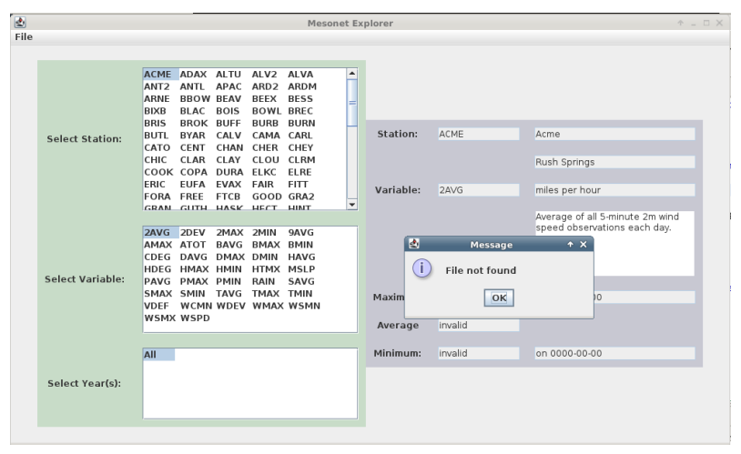

加载之后，你的程序将会显示选中年份的监测站和变量：

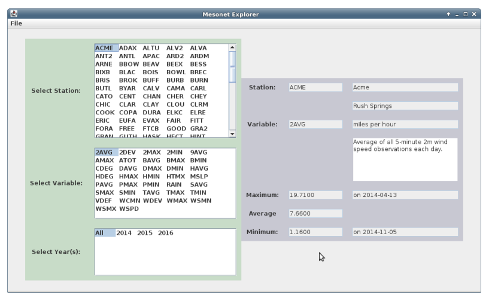

另外一个例子

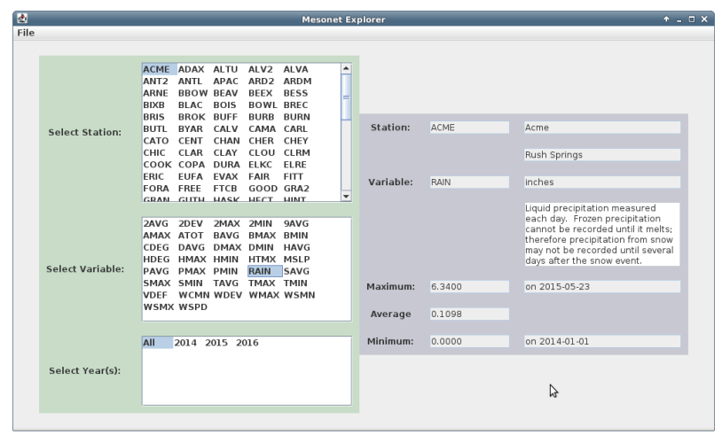

可以选中特定年份

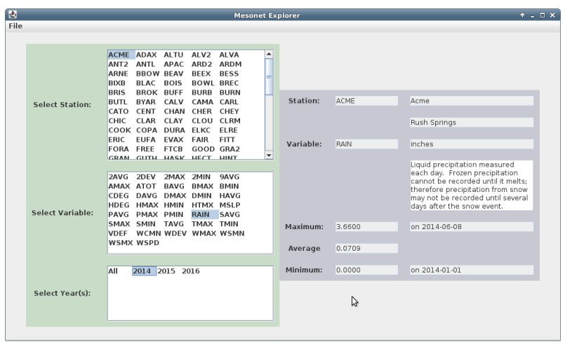


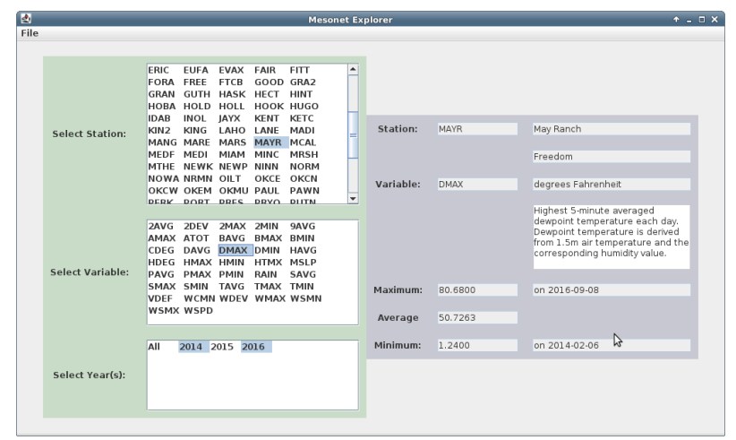

一些其它例子

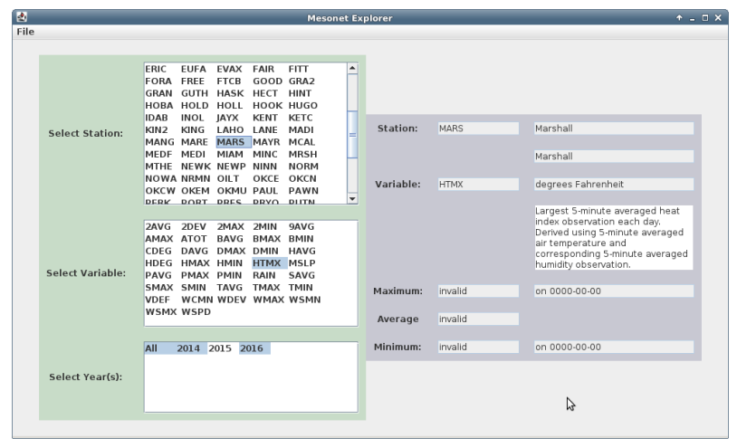

注意：0000-00-00会出现是因为2016年不包含十一月和十二月的数据。因此十二月的min/max是一个无效DataDay，即显示0000-00-00作为日期。因为我们的isLessThan和isGreaterThan实现方式，这个无效天会重载包含数据的所有月。

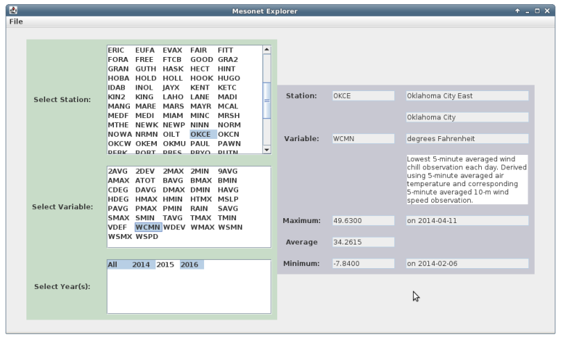

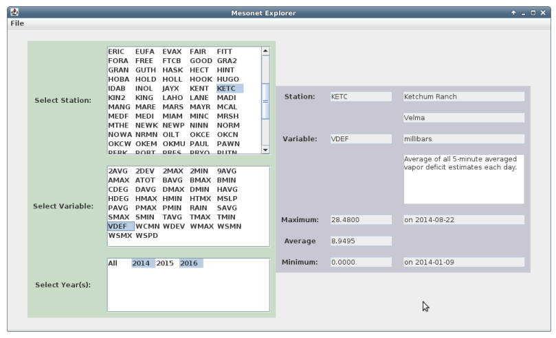


# GUI布局
下面是我们的GUI布局的草图，我们描述了关键GUI组件和它们的近似布局。我们也描述了组件之间的容器包含关系，一些相关的实例变量也标示出来了。

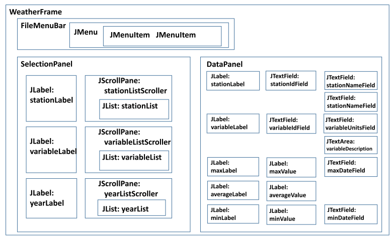

**WeatherFrame**包含三个主要组件：一个**FileMenuBar**，一个**SelectionPanel**和一个**DataPanel**。

**FileMenuBar**包含一个单个**JMenu**，这个菜单又包含两个**JMenuItems**。

**SelectionPanel**包含一组子组件格：行对应于可选的监测站，变量和年份。第一列包含标签，第二列包含一组**JLists**，用于选择。注意每个**JList**被包含在一个**JScrollPane**中。这些滚动面板让包含其中的**JList**有充分的显示空间。如果一个列表太大，**JScrollPane**会在列表右侧自动显示一个滚动条。

**DataPanel**根据用户的选择显示信息。一组标签被显示在第一列。剩余的列可以是**JTextField**或者**JTextArea**对象，用于显示特定**Strings**。

# UML设计
你将采用项目3的实现，做一些小改动，细节如下。下面是你要为本项目实现或修改的新类。

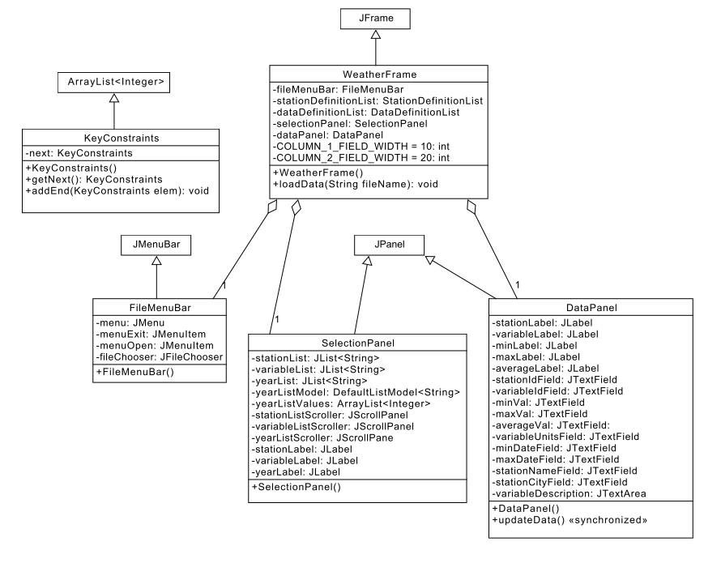

# 类设计概要
本项目和项目3的代码大体上相同。关键区别是我们要对一组子集键计算统计。例如，在本项目中，尽管所有的年份（2001，2002，2003，2004和2005）的数据已经被加载，但我们只对2001，2002，2003年统计最大值日期。我们将用一组和我们期望的统计计算相关的键来表达这些"受限的查询"。

这些限制由一个**KeyConstraints**类的实例来表示。对于本项目，我们仅限制一个**DataSet**内的年份。但是，在下一个项目中，我们还将限制一个**DataYear**中的月和一个**DataMonth**中的天。为了有效表达这种关系，**KeyConstraints**类实现一个限制链：年份上的**KeyConstraints**会指向下一个月份上的**KeyConstraints**，同样的，月份上的**KeyConstraints**，将指向日上的**KeyConstraints**。

下面是对项目3代码的关键改变：

- 所有的**getStatisticAverage()**，**getStatisticMinDay()**和**getStatisticMaxDay()**方法现在将带一个额外的**KeyConstraints**参数。对于每个方法实现，该参数会被添加到参数列表中。
- **DataDay**将接受这个参数但会忽略。
- **MultiStatisticsAbstract**类将使用**KeyConstraints**对象来限制遍历过程中哪些键要被搜索。另外，当该类调用其子类上的getStatisticXX()方法时，它将传递**constraints.next()**。注意如果一个限制引用是**null**，那么getStatisticXX()方法应当使用所有可用的keys，和项目3做法一样。
- **StationDefinition**和**StationDefinitionList**类仅会将限制传递到下一层。
- **DataYear**类
    - 增加如下属性
```java
    private static TreeSet<Integer> yearList;
```
    - 在构造函数之外初始化该属性
    - 每次日被添加到年，将日对应年添加到这个集合
    - 添加如下访问器方法：
```java
    public static ArrayList<Integer> getYearList()
    {
        return new ArrayList<Integer>(yearList);
    }
```

下面是GUI的实现注意点：
- 在本项目中，我们将使用**GridBagLayout**作为frames和panels的布局管理器。
- **WeatherFrame**：该类是一个**JFrame**，也是用户接口的主要窗口。
    - 完成构造函数的实现
    - 完成**loadData()**的实现
- **FileMenuBar**是**WeatherFrame**的一个内部类，它 is-a **JMenuBar**。
    - 完成菜单创建流程
    - 完成打开菜单监听器的实现
- **SelectionPanel**是一个内部类，它 is-a **JPanel**，用于展示用户可以选择监测站，变量和年份的元素。该类包含针对每种选择类型的**JList**。
    - 完成JLists的创建
    - 实现组件的布局
- **DataPanel**是一个内部类，它 is-a **JPanel**，显示选中的信息和相关的统计。
    - 完成**JTextFields**的创建
    - 实现组件的布局
    - 完成**updateData()**方法的实现。注意该方法被声明为*synchronized**，表明该方法是线程同步方法，多线程并发时只能有一个线程访问。

# 注意
- 以增量方法构建你的GUI。在添加功能前专注你的界面外观，然后，一次添加一项功能
- 使用多个组件来表示GUI让我们能逻辑地将问题切分为小的组件，因为这些组件是相互独立的，相当于降低了问题复杂性。
- 通过将所有类（一个除外）设置为一个大frame类的**内部类**，让我们能更容易地处理各种GUI类之间的依赖。特别的，内部类能够访问外部类的变量和方法（即便它们是私有的）。例如，内部类可以如下方式引用外部类：
**WeatherFrame.this**
然后可以访问变量和方法：
**WeatherFrame.this.stationInfoList**
**WeatherFrame.this.setCursor()**
另外，一个内部类可以部分访问另外一个内部类。例如，**SelectionPanel**实例可以用下面方式让**DataPanel**实例更新：
**WeatherFrame.this.dataPanel.updateData()**
- *JMenuItems**有关联的**ActionListeners**，实现选择一个菜单项的功能
- 你可以这样创建到数据目录的引用：**new File("./data")
- **JList**为用户展示一列项目，让用户可以选择其一（或多个）。后面的参考章节有相关API文档链接。
如果列表中的项目是既定不变的，则创建**JList**的简单方式是传递一个字符串数组。你可以让**JList**自动选择列表中的第一项:**setSelectedIndex(0)**
可以添加一个**SelectionListener**监听器，对选中的项目进行响应。改变既可以是不选中一个项，也可以是选中一个项。当前的选中元素（如果假定只有一个）可以通过调用**JList**的**getSelectedValue()**方法获取。
如果一个**JList**允许你选择超过一个项目，你可以通过调用**getSelectedIndices()**，来访问选中项的索引列表。
如果项目是事前不知道的，或者会随时间改变（如我们的年份列表，我们在加载数据之前无法提前知道），我们就必须使用某种形式的**ListModel**。**DefaultListModel**类是一个可以添加或者清除项目的**List**。每次这个列表变化时，**DefaultListModel**会自动通知**JList**列表改变了，这会导致**JList**显示界面的更新。可以通过向**JList**构造函数传递一个*ListModel**引用的方式，将**ListModel**和**JList**关联。
- 每一个**JList**被置于一个**JScrollPane**中。也就是说GUI会使用一个固定大小的pane来呈现信息，如果信息太大无法在固定区域呈现的话，则pane会自动提供滚动条。如果信息大小正好，则滚动条会自动隐藏。
- **JTextFields**缺省是用于从用户接收文本输入的。但是，通过将其*editable*属性设置为*false*，它们可以被用作仅用于信息展示的组件。我们可以通过设定**JTextField**可以容纳的字符数来定义其宽度。并且，**JTextField**中的文本可以被用户用鼠标操作选中和拷贝。
- **JTextArea**可以显示多行文本。我们建议如下设置：**setWrapStyleWord(true)**和**setLineWrap(true)**


#最后步骤
### 步骤1
使用Eclipse为你的所有类生成Javadoc，

### 步骤2
在Eclipse或者你常用的浏览器中打开project4/doc/index.html文件。 确保Javadoc中包含你的类（五个主要类和四个单元测试类），所有的方法包含必要的Javadoc文档。


# 参考
- [Java API](https://docs.oracle.com/javase/8/docs/api/)
- [JLists](https://docs.oracle.com/javase/tutorial/uiswing/components/list.html)
- [JFileChooser](https://docs.oracle.com/javase/tutorial/uiswing/components/filechooser.html)
- [Menus](https://docs.oracle.com/javase/tutorial/uiswing/components/menu.html)


