项目5：图形用户接口
======

# 介绍
在项目4中，你创建了一个图形用户接口和用户交互并显示请求的Mesonet数据。本项目将扩展你在图形领域的经验。特别的，你将在空间上显示最小/最大/平均统计信息，通过在俄克拉何马州的各个县区绘制信息。

你在之前项目的实现会作为本项目的重要基础，同时要做一些小修改：

你最后的项目将：

1. 加载描述Mesonet监测站，记录每个站点的测量（变量），和县的文件
2. 允许用户指定一个要加载的数据文件
3. 允许一个用户选择一个感兴趣的变量，年份，月份和日。
4. 允许用户选择一个要计算的最小，平均或者最大统计值
5. 报告选中年份，月份和日期上的统计。这些统计会依次绘制在俄克拉何马州的区县地图上
6. 当一个区县被点击，你的GUI会弹出一个窗口，它描述该区县和其内的所有统计

# 学习目标
完成本项目后，你应该能够：
1. 在一个二维平面上表示形状信息
2. 使用形状信息为形状涂色
3. 使用图形信息来检测什么时候一个图形被鼠标选中了
4. 计算一个区县的多个监测站的min/max/average统计
5. 打开包含数据的弹出窗口
6. 持续实践Javadoc和测试最佳实践


# 成功策略
- UML规范了你要实现的新类和新方法
- 当你实现一个类或者方法，请专注于那个类或者方法要做的事情，请尽可能的将大问题先抛诸脑后。
- 我们鼓励你和同伴紧密合作，尽可能沟通讨论。
- 尽早开始项目，在大多数情况下，本项目不可能在一两天内完成。
- 以增量方法实现和测试你的项目组件，不要等整个项目都实现完成了再开始测试流程。
- 以增量方式写文档，不要等到整个项目都实现完成再补文档，在实现代码**之前**先写文档是一个好的实践。

# 准备工作
- 在Eclipse中，将你的*project4*目录拷贝到一个新的*project5*项目。在该项目中，你的数据应当位于*data*目录中。数据和上个项目是一样的。
- 下载[项目文件](project5.zip)。该zip文件包含如下文件，它们应当被拷贝到你的project5项目：
    - **CountryExplorer**：主程序
    - **StateFrame**：主接口，**请完成该实现**
    - **ColorBar**：用于绘制一个颜色条的类，和将数量值转换成颜色
    - **CountryDefinition**：描述区县形状和监测站类。**请完成该实现**
    - **CountryDefinitionList**：描述所有的国家。**请完成该实现**
    - **CountryFrame**：一个描述单个区县的弹出窗口类
    - **MultiStatisticsWithDaysAbstract**：扩展自**MultiStatisticsAbstract**的抽象类，现在是**DataSet**，**DataYear**和**DataMonth**的父类
    - **StatType**：一个枚举数据类型
    - **countyShapes.csv**：一个包含一组区县坐标（表示区县边界）的文件


# 交互样例
下面是一组我们实现的截屏，你实现的界面应该类似。当你的程序启动，它将马上加载监测站、变量和区县配置文件，但不会加载数据文件。给定加载的信息，下面是最初的接口状态：

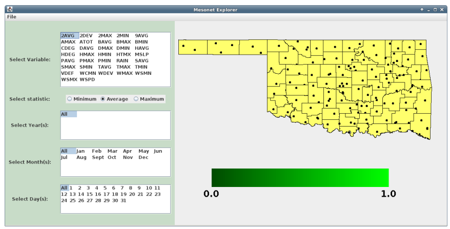
注意区县的轮廓将被画出，包括监测站的位置（有小圆圈标明）。

当用户点击一个区县，关于区县和区县内检测站的信息江北显示在一个单独的弹出窗口内。这个窗口是非模态的，可以同时打开多个。

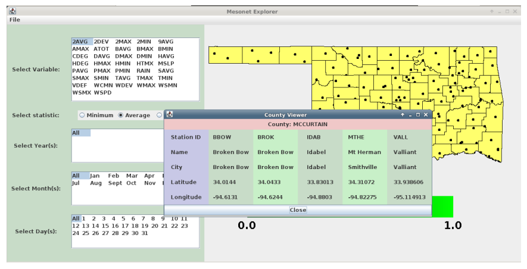

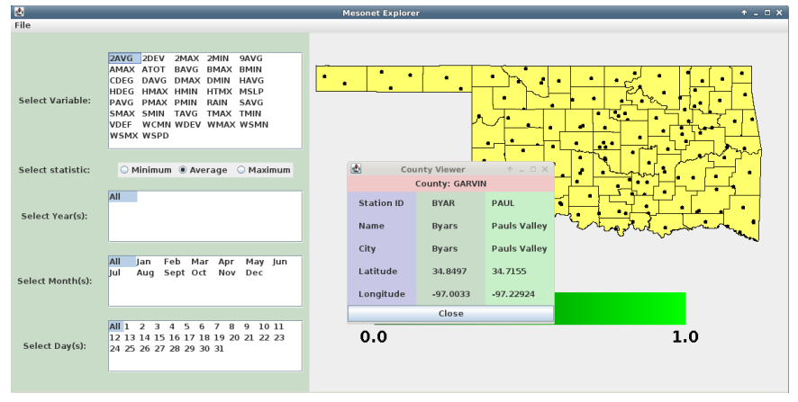

注意如果用户点击州外的区域，那么不会弹出窗口。

当用户选择**File/Open text file**，接口将弹出一个文件选择框：

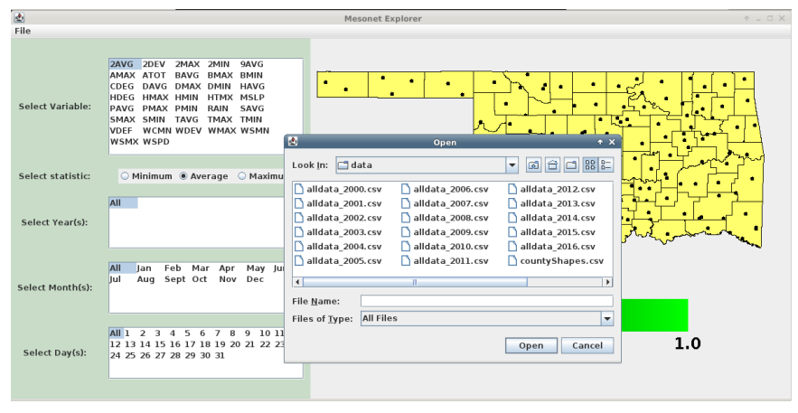

如果选择的文件有效，那么它将被加载到内部数据结构。如果文件无效，那么将弹出错误提示窗口。

一旦一个文件被选中和打开，统计信息就可以被显示。用户可以选择：
- 感兴趣的测量（variableId）
- 感兴趣的统计（最小，平均和最大）
- 感兴趣的年份。可以选择任意年份的组合
- 感兴趣的月份。可以选择任意月份的组合
- 感兴趣的日期。可以选择任意日的组合

当一组选择被确定，统计信息就可以被绘制到州表示图上：
- 每个区县根据选中的统计和数据进行表示和绘制。对于没有数据或者含无效数据的区县，它被绘制的颜色应该和含有效数据的区县却分开。
- 一个颜色条表明值是如何用颜色表示的。颜色条捕获的值的范围是由所有区县上选中统计的最小和最大值决定的（这样我们可以有效使用整个颜色范围）。颜色条显示这些最小和最大值。
- 标签用于描述选中的统计和其单位。

当所有的年份，月份和日期被选中，接口看起来是这样的：


可以选择部分年份，包括不连续的范围：

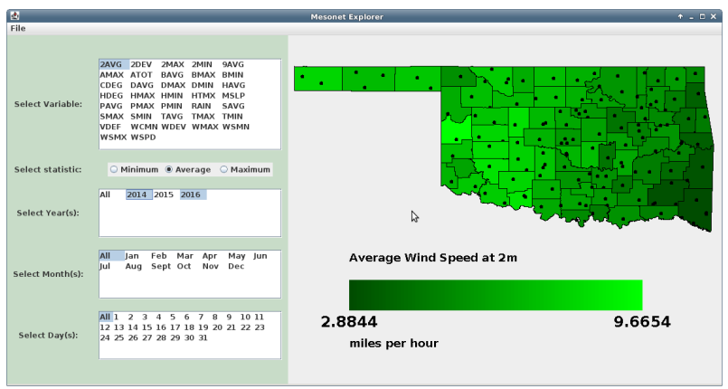

可以选择部分月份：

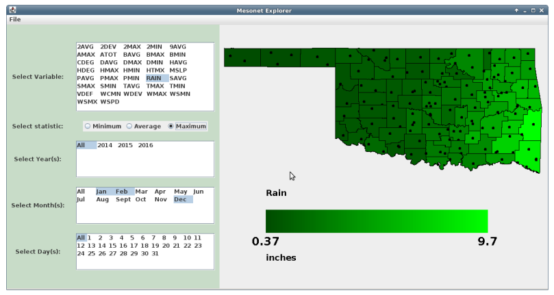

也可以选择部分天：

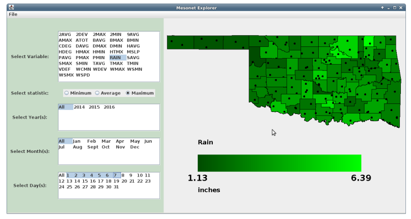

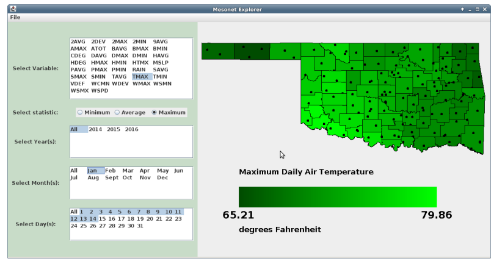

其它一些样例：

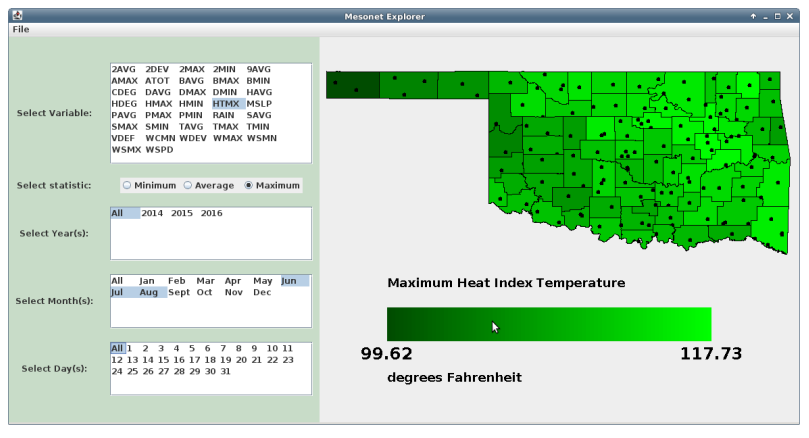

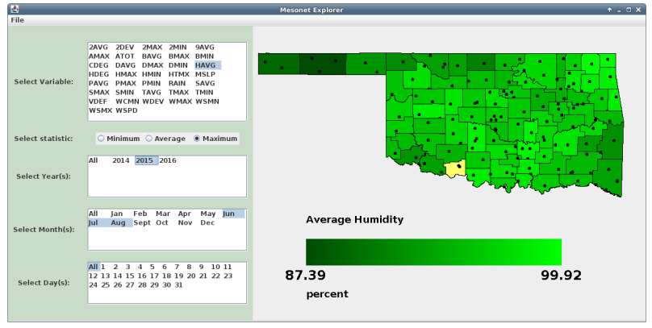

注意：注意没有被着色的区县表示选中的日期和变量没有有效数据。

# UML设计
下面是UML图，强调区别于项目4有改变的类。

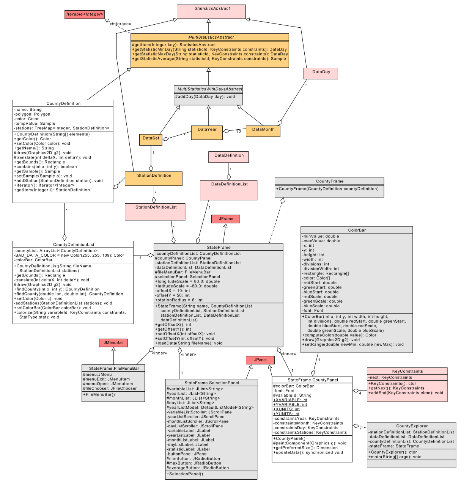

其中的颜色表示类由：我们提供的（*灰色*），你从项目4带过来的未改变的（*粉色*），你从项目4带过来的有小改变的（*橙色*），我们提供了骨架你必须补充细节的（*白色*），和Java API提供的(*红色*)。


# 类设计概要
你的项目4代码大部分不变，关键点如下描述：
- 项目4中的**MultiStatisticsAbstract**被分拆为**MultiStatisticsAbstract**和**MultiStatisticsWithDaysAbstract**类。分拆的细节见UML表示。请相应修改你的类。
- **StationDefinition**：添加一个如下原型的方法：
```java
    public void draw(Graphics2D g2)
```
该方法画在监测站所在经度和纬度画一个圆圈。注意比例和偏移由**StateFrame**类提供。
另外，**StationDefinition**现在必须继承自**StatisticsAbstract**。
- **CountyDefinition**描述单个区县，包括它的形状，区县内包含的监测站，和它的着色颜色。该类也提供方法支持绘制区县的形状，和确定一个点是否包含在区县内。请完成构造函数。完成*draw()*，*contains()*，*getBounds()*和*addStation()*方法。
- **CountryDefinitionList**描述俄克拉何马州内的所有区县。构造函数负责从一个CSV文件读取区县数据，创建区县列表，和处理经纬度坐标和屏幕坐标间的转换（转换涉及一个按比例缩放和一个转换）。请完成这个构造函数。文成*getBounds()*，*translate()*，*draw()*，*addStations()*，*colorize()*和*findCounty()*方法。
- **StateFrame.CountyPanel**类负责显示俄克拉何马州。完成*mouseClicked()*方法。为颜色条选择参数。完成*paintComponent()*和*updateData()*方法。
- 重新review你的**KeyConstraints**实现，实现一组恰当的单元测试。
- 为**CountyDefinition**提供单元测试
- 提供单元测试，确保**StationDefinition**在给定一组限制情况下，能产生正确的统计值。

# 注意
- 在项目4中，我们用**KeyConstraints**选择一组年份子集。因为我们查询一个区县的统计值，我们必须提供一个含四个不同限制的列表，顺序如下：监测站，年份，月份和天。
- 我们假定经纬度和屏幕坐标之间是线性转换。我们已经选定缩放比例（作为固定参数），但我们在所有国家被选定后才确定偏移值。
- 区县名和形状信息被定义在*countryShapes.csv*文件中。每行包含一个国家的数据：区县名称，后面跟一个经纬度对组成的序列。不同区县的坐标数量各不相同。
- Java API提供了很多有用的类。我们强烈建议你仔细阅读**Shape**，**Polygon**和**Graphics2D**类的API。


#最后步骤
### 步骤1
使用Eclipse为你的所有类生成Javadoc，

### 步骤2
在Eclipse或者你常用的浏览器中打开project5/doc/index.html文件。 确保Javadoc中包含你的类（五个主要类和四个单元测试类），所有的方法包含必要的Javadoc文档。


# 参考
- [Java API](https://docs.oracle.com/javase/8/docs/api/)
- [为色盲读者选择颜色的技巧](http://www.somersault1824.com/tips-for-designing-scientific-figures-for-color-blind-readers/)


